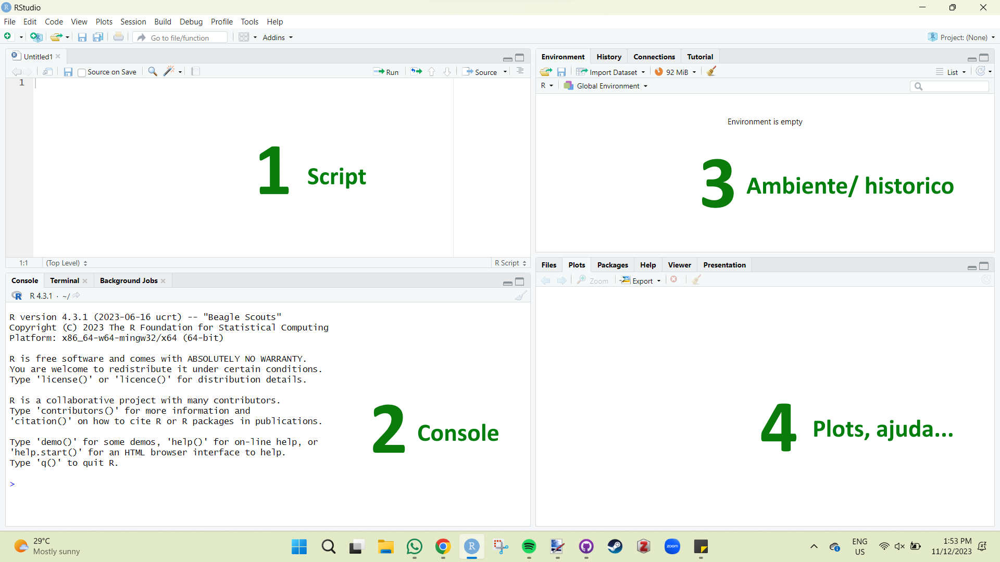
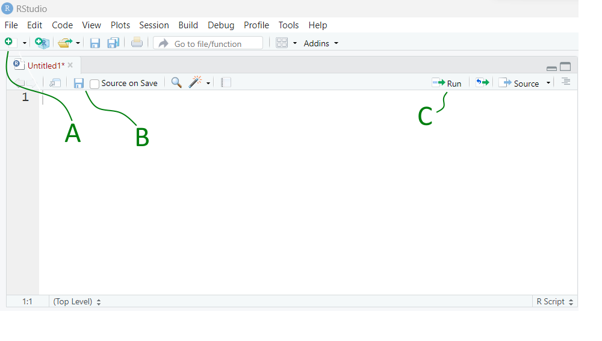
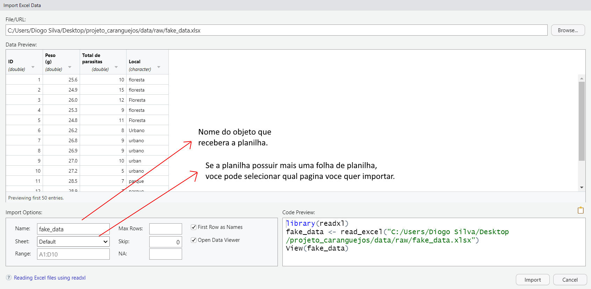
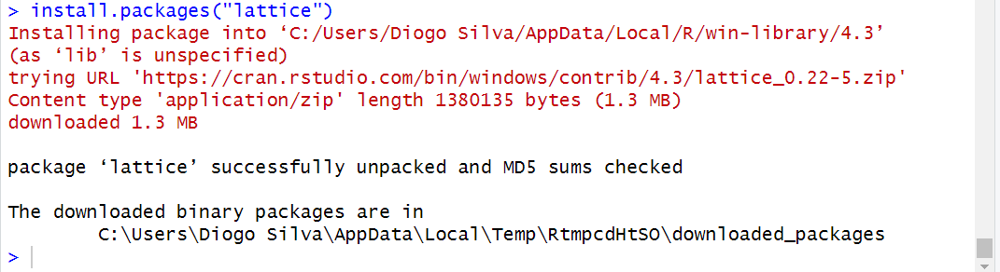

# R para iniciantes

Caro iniciante, meu objetivo aqui é mostrar que utilizar o R é muito divertido e recompensador. Você vai perceber que cada código rodado (e que funciona) vai te dar um pouquinho de dopamina e uma sensação de prazer. Claro que alguns erros vão te deixar maluco, mas você vai perceber que tudo é culpa sua. Mas não se preocupe, se é culpa sua, você pode consertá-los :)

A tendência é que, quanto mais você utilizar o R, mais fácil sua vida se tornará, e, apesar da curva de aprendizagem ser um pouco desestimuladora, é 1000 vezes recompensadora. Como alguns gostam de dizer, você conseguirá fazer um gráfico até 30 vezes mais rápido! Não sei de onde veio esse cálculo, mas se está na internet, é verdade.
  
## Entendendo o RStudio
  
Tudo que faremos será através do R Studio devido à organização que ele nos fornece. O RStudio é uma roupagem para o R, que nos oferece um ambiente de trabalho mais amigável e organizado. Se você seguiu as instruções de instalação corretamente, terá dois ícones, o do R base e o do RStudio. Vamos abrir o programa RStudio dando dois cliques sobre seu ícone (Figura 1).

{ width=200px }
  
Ao abrir o R Studio, você verá o seguinte:
  


Não tem a aparência convencional dos programas estatísticos, mas isso acontece porque não se realizam tarefas clicando em abas ou botões. No R Studio, você executa comandos por meio de códigos! No futuro, é provável que exista um programa com o qual você poderá conversar em qualquer idioma, e ele realizará as tarefas que você pedir. Não, pera, isso já existe! Chama-se inteligência artificial! Entretanto, não se deixe enganar. Os conhecimentos íntimos de como pensar, organizar, analisar e mostrar seus dados são importantíssimos para todo um projeto científico. Mas se isso não te convence, as melhores inteligências artificiais do mercado são pagas e podem te retornar resultados enganosos. Então, tenha muito cuidado e utilize as inteligências artificiais disponíveis apenas como uma ferramenta auxiliar!
  
Vamos ao que importa: entender como o R funciona. O R possui uma linguagem, e tudo que você vai fazer no R é utilizando essa linguagem, que são verdadeiros comandos. Importe essa planilha! Crie esse gráfico! Faça a média dessa variável! E por aí vai. Então, vamos dar o nosso primeiro comando para o R e falar diretamente com ele. Pediremos que ele some 1 + 1, e para fazer isso iremos digitar 1 + 1 no console (Figura 2 - janela 2) e apertar a tecla "Enter".
  
```r
1+1
```
  - *Dica: Utilize este livro realizando os comandos sugeridos diretamente no R Studio.           Sinta-se livre para executar outros comandos similares.*
  
Ao fazer isso, ele vai te retornar o valor 2 (resultado da operacao). Você pode utilizar o R como uma calculadora e realizar as operações básicas normalmente. Agora, vamos pedir para ele subtrair 10 - 5, digitando no console e pressionando Enter. Perceba que não faz diferença se você digitar 10-5, 10 - 5, 10-5, ou até mesmo 10 -5. Mas claro que ao escrever códigos, iremos utilizar a forma que mantém o código mais organizado. Minha sugestão é utilizar 10 - 5.

```r
10 - 5
```
  
Agora vamos pedir para ele multiplicar:

```r
5 * 5
```
E dividir:

```r
10 / 2
```
  
Você deve ter percebido que cada operação matemática possui seu próprio símbolo. A facilidade de encontrar informações na internet é uma das vantagens do R. Ser gratuito, de código aberto e contar com uma comunidade altamente ativa torna o R singular. Ao longo do livro, você encontrará alguns tópicos nos quais peço que realize pequenas tarefas para compreender o código e desenvolver autonomia.
  
  - *Dica: Pesquise como realizar potenciacao no R e calcule 2 elevado a 2. voce pode utilizar o chatgpt!*
  
Massa! Mas você deve concordar comigo que essa forma de interagir com o R não é muito eficiente. Apesar de mostrar o histórico, se você quiser realizar a primeira operação que fizemos (1 + 1), precisará digitar novamente sempre que quiser fazer algo. Por esse motivo, a janela de script (Figura 2 - janela 1) se torna tão importante.
  
Vamos criar um script e utilizá-lo em uma situação prática. Mas antes, precisamos aprender mais alguns botões. Veja a figura abaixo:
  

Vamos criar um novo Script clicando no **botão "A" > New Script**. No Script, podemos digitar livremente sem que o código seja executado; inclusive, podemos fazer comentários utilizando o símbolo **#** antes do que foi digitado. Podemos apertar **Enter** para pular a linha sem enviar o código para o R. O código apenas será executado se clicarmos na linha do código e apertarmos o botão **"C"** (Run) ou **Ctrl + Enter**. Copie e cole o código abaixo no seu script e execute, apertando Ctrl + Enter linha por linha. Perceba que o **#** impede que o nome Script seja executado. Se você executar Script sem a #, o R não vai entender e vai dar erro (voce pode tentar fazer isso para ver o que acontece).
  
```r
#Script 

1 + 1
2+ 2
10/2
5+5-2/2

#Fim
```
  
O comentário também pode ser feito na mesma linha após o código, permitindo utilizar comentários para explicar o que o código faz.
  
```
2*50 #Esse codigo realiza uma multiplicacao.
```
Por fim, voce pode salvar o Script para acessá-lo sempre que quiser clicando no **botao "B"** (disquete de salvar) e selecionando um local no computador. Voce pode acessar esse script salvo sempre que quiser retornar e continuar um trabalho.
  
  - *Dica: Crie um mini script com diferentes funções matematicas do jeito que voce quiser, incluindo comentarios e explicando como realizar isso no R. Use o chatgpt para     criar equacoes mais complexas so para ver o poder do R como uma calculadora e como ferramenta auxiliar.*
  
  - *Outra dica: sempre que você estiver no computador e quiser fazer algum cálculo, por mais simples que seja, não use uma calculadora (do PC ou celular), use o R. Praticar é a chave!*
  
## Objetos, vetores e funções

### Objetos
  
Uma das capacidades mais importantes do R é a capacidade de armazenar valores em objetos. Por exemplo, podemos dizer que o número 1 será atribuído à letra "**a**", e para isso utilizamos o sinal de igual (**=**). O "**a**" agora é considerado um objeto e aparecerá na janela de Environment (Figura 2 - janela 3).

```r
# Criando objetos
a = 1  
b = 2  
```
  
Entretanto, o sinal de atribuição mais utilizado é a seta (**<-**), devido à sua direcionalidade. Então, vamos adotar esse símbolo de atribuição. Guarde isso na sua cabeça: o código **<-** significa **atribuir**.

```r
# Criando Objetos
c <- 3 # c recebe 3
d <- 5 # atribuimos 5 ao d
```
  
Se você está copiando e colando os códigos do livro no seu script, e pressionando **Ctrl + Enter** em cada linha, você criou quatro objetos por meio das atribuições. Os objetos são a, b, c e d. No entanto, você só receberá o valor respectivo de cada um se digitar o objeto e executá-lo com Ctrl + Enter. 

```r
a
b
c
d
```
  
Com esses objetos, podemos realizar operações matemáticas.

```r
#Operacoes com objetos

a + b
c * d
b/2
2 * d

#Fim
```
  
*Nesse momento, meu consagrado aprendiz, eu espero que você esteja realizando diferentes operações matemáticas, utilizando diferentes atribuições*
  
Podemos atribuir valores em palavras inteiras. Como por exemplo, atribuir 10 ao objeto chamado "nota" (ou qualquer outra palavra).

```r
nota <- 10
Nota <- 0
```
Perceba que o R detecta as diferenças entre letras maiúsculas (caixa alta) e minúsculas (caixa baixa). Portanto, "nota" é diferente de "Nota". Muito cuidado com isso. Conheço um rapaz que sempre aparece desesperado dizendo que o código não está funcionando, e 100% das vezes, é um erro de digitação. Para evitar erros, sugiro sempre utilizar letras minúsculas.
  
Alguns símbolos não podem ser utilizados para criar objetos, uma vez que são reservados para finalidades internas no R, como por exemplo o '**-**', ou **TRUE** / **FALSE**. Perceba que ao rodar os códigos abaixo, o R irá retornar um erro.

```r
FALSE <- 2
TRUE <- 5
guarda-chuva <- 2
```
Também podemos atribuir uma equação inteira a um objeto. Na verdade, podemos atribuir quase tudo a um objeto: gráficos, resultados, planilhas, etc. Mas isso veremos mais adiante.

```r
#Note que o underline (_) funciona bem para separar palavras, assim como ponto (.)
guarda_chuva <- 2*10/2
guarda_chuva

guarda.roupa <- 2*100/10
guarda.roupa

```
Alem disso tudo, podemos atribuir um texto a um objeto. Mas para isso o texto precisa estar entre aspas. Muito importante esse detalhe!!!

```r
#Atribuindo a palavra "coxinha" ao objeto melhor_comida
melhor_comida <- "coxinha"
melhor_comida

bingo  <- "10" 
bingo2 <- "5"

#Somar bingo + bingo2 nao vai funcionar pois o numero 10 e 5 foram atribuidos como texto
bingo + bingo2
```
  
Mas para que serve tudo isso? Por que aprender essas coisas de objetos, atribuições, e sei que lá? A resposta principal é a capacidade de automação e reprodutibilidade das suas análises. Você poderia usar outro programa estatístico? Poderia. Mas confie que o negócio aqui não possui limites.
  
Vamos criar um exemplo prático para fixar conceitos. Vamos imaginar que queremos calcular quanto gastamos de aluguel por mês e por ano, considerando que pagamos o aluguel semanalmente. Vamos supor que o aluguel por semana seja de 200 reais.
  
  
```r
#Calculando o aluguel

aluguel_semana <- 200              #valor do aluguel por semana (em reais)
aluguel_mes <- 4 * aluguel_semana  #considerando que 1 mes possui 4 semanas.
aluguel_ano <- 12 * aluguel_mes    #Para o aluguel por ano basta apenas multiplicar o aluguem mes por 12.

#Aqui vemos o resultado de cada um deles (Ctrl + Enter neles)
aluguel_semana
aluguel_mes
aluguel_ano
```
Veja que massa! Criamos um script para calcular o valor do aluguel por mês e por ano. Com esse script, você pode calcular facilmente diferentes situações, simulando diferentes valores de aluguel. Para isso, é só alterar o valor 200 de **aluguel_semana** para o valor desejado e rodar linha por linha.
  
  - *Dica: crie o objeto aluguel_dia que te dara a possibilidade de contabilizar qualquer quantidade de dias, bastando apenas multiplicar o objeto (aluguel_dia) pela quantidade de dias desejado.*
  
Se você pode fazer isso para calcular o aluguel, imagine o que esse sistema pode fazer pela sua análise de dados.
  
### Vetores
  
Os objetos com múltiplos valores do mesmo tipo são chamados de vetores. Para criar um vetor, inserimos os valores dentro de parênteses separados por vírgulas. 
  
  *(2, 4, 6, 8)*
  
  Mas o R so vai entender que isso eh um conjunto de valores, se voce indicar para ele, e a gente indica isso, utilizando a letra **c**.
  
  *c(2, 4, 6, 8)*
  
Esse **c** vem da palavra "combinar" (combine ou concatenate em ingles) mas eu acho mais facil lembrar desse **c** representando a palavra "conjunto". Sempre que voce quiser criar um conjunto de objetos ou valores, coloque esse **c** antes do parenteses. Vírgulas no R servem para separar o código. Então, se você quiser digitar números quebrados, nunca utilize **vírgula**, utilize **ponto**.
  
  ```r
#Criando um vetor
c(2, 8, 15)

#atribuindo esse vetor a um objeto
vetor.a <- c(2, 8, 15)
vetor.b <- c(2.5, 2.2, 2.1)
melhores_comidas <- c("coxinha","pastel","lasanha") #Lembre-se, caracteres precisam estar dentro de aspas.
  
vetor.a
vetor.b
Melhores_comidas

```
  Opa, deu um erro, né? Estou marcando o tempo de quanto tempo você demorou para perceber que o nome do objeto é "melhores_comidas" e não "Melhores_comidas" com M maiúsculo. É só pra ficar ligado.
  
### Funções
  
No R, as funções servem para processar de alguma forma os dados. O R já possui algumas funções nativas, como, por exemplo, para calcular a raiz quadrada de um número. A função possui um nome, geralmente associado ao que ela faz, e argumentos que são o tipo de dado que você precisa inserir nela para ser calculado. Vamos dar uma olhada na função sqrt(). A sigla "sqrt" representa "square root" em inglês. Primeiro, vamos rodar a função sem argumentos, apenas o **sqrt()**, e depois inserimos o argumento, que nesse caso, é um número.

```r
#funcao que calcula raiz quadrada

sqrt()

sqrt(25)

```
  Note que quando não colocamos (ou erramos) o argumento, o R vai te retornar um erro, geralmente, explicando o problema.

Existem funções dentro do R para todo tipo de coisa! Vamos criar um vetor (conjunto de dados) e fazer alguns cálculos utilizando algumas funções.
  
  ```r
#Notas do terceiro ano A
#Cada um desses numeros representa uma nota de um aluno
notas <- c(10, 8, 7, 5, 2, 4, 6.6, 7.9, 8.9, 9.5)

#Qual a media da turma?
mean(notas)

#Qual a mediana?
median(notas)

#Qual o desvio padrao das notas?
sd(notas) #sd vem de standard deviation

#Qual a menor e a maior nota?
min(notas)
max(notas)

#resumo das notas
summary(notas)

```
  
Cada uma dessas funções realiza algum cálculo específico. No caso de summary(), ela realiza o cálculo da média, mediana, máximo, mínimo e quartis, tudo ao mesmo tempo. 

Certamente, não existem funções apenas para cálculos; há uma variedade delas com diferentes finalidades. Com o tempo e prática, você incorporará essas funções em seus códigos, o que facilitará bastante seu fluxo de trabalho. Abaixo voce encontra alguns exemplos.
  
```r

#Criando um objeto
objeto <- 5

#Ver quais objetos voce tem criado
ls()

#Remover algum objeto
remove(objeto)

#verificar se o objeto foi removido
ls()

#saber a hora do sistema
Sys.time()

#Criar uma sequencia de valores numericos de 1 ate 100 de dois em dois.
seq(1, 100, by = 2) #obs: voce pode atribuir isso a um objeto

#criar um conjunto de numeros ou texto repetidos
rep(5, times = 10)
rep("troxa", times = 10) #obs: olha so, texto tem que ser entre aspas.

#Criar um vetor
c(2,5,6)

#Plotwist: sim, aquele "c" na verdade uma funcao c()
```
  
  Talvez, em algum momento, você não encontre a função necessária para uma tarefa específica; nesse caso, você pode criar sua própria função! Você pode, inclusive, construir uma função utilizando outras funções para realizar uma tarefa específica. Por enquanto, vamos apenas ser usuários de funções e não criadores. No entanto, se realmente quiseres aprender a criar uma função, não vou te limitar. No capítulo "Criando funções", vou te ensinar o básico de como fazer isso.
  
## Tabela de dados
 
### Data frame
DataFrame nada mais é do que uma tabela de dados. Vamos direto ao que interessa e usar a função *data.frame()* para criar uma tabela. Iremos criar as notas de 10 alunos e seus respectivos nomes. Se você ainda estiver na mesma sessão de R, podemos ver que o objeto "notas" ainda está salvo na janela 3 (Environment e History) e podemos aproveitá-lo. De qualquer forma, vou recriar "notas", caso por algum motivo você TENHA SAÍDO do R, um absurdo, mas acontece.
  
  ```r
#Criando um data frame contendo as notas e os nomes de cada aluno

#Primeiro criamos as notas (cada numero representa a nota de um aluno)
notas <- c(10, 8, 7, 5, 2, 4, 6.6, 7.9, 8.9, 9.5) 

#Segundo criamos os nomes (na ordem das notas)
#Ex: o primeiro valor do objeto nota (10) representara a nota de Marilia que eh o primeiro nome.

nomes <- c("Marilia", "Jonatas", "Guilherme", "Thiago", 
"Fifi", "Brunnin", "Diego", "Mazana", "Bruna", "Vitoria")

```
  
A funcao data.frame() pega cada objeto e coloca na tabela como colunas.

```r
#Terceiro utilizamos a funcao data.frame() para criar a tabela
tabela <- data.frame(nomes, notas) #cada argumento aqui sera uma coluna no data.frame
tabela

#vamos criar mais uma nova coluna no data.frame chamada de ID
ID <- c("1A","2A","3A","4A","5A","6A","7A","8A","9A","10A")

#Vamos criar uma tabela incluindo essa nova coluna
tabela2 <- data.frame(ID, nomes, notas)
```
Esse data.frame (tabela) é uma forma muito simplificada das tabelas que iremos importar de nossos dados reais. No entanto, ela nos serve muito bem para entender como funciona uma planilha no R.

A partir de agora, quero que você perceba uma coisa muito importante e leve isso para a vida. Uma planilha organizada deve ser construída da seguinte forma:

  -Variáveis são colunas;
  -Observações são linhas;
  -Cada valor na sua célula.
  
Com essa formatação de planilha, você consegue fazer quase tudo no R, para manipulação de dados, construção de gráficos e análises estatísticas.

Logo, para você acessar uma variável de uma tabela, usamos o **$** da seguinte forma:

  ```r
#Acessando uma variavel

tabela$nomes
tabela$notas
tabela$ID
```

Perceba que quando você digita **tabela$**, pode apertar a tecla TAB para mostrar e selecionar as variáveis de sua tabela. 

  - *Dica: crie um novo data.frame das notas dos alunos, mas adicionando uma variavel (coluna) chamada "faltas".*

Caso alguma nota esteja errada e você queira corrigi-la, pode utilizar a função *fix()*. Essa função abre uma janela onde você pode clicar e modificar o valor desejado.
  
  ```r

fix(tabela)

```
Quase nunca utilizamos a função *fix()* para corrigir os dados, mas é interessante saber que o R pode abrir novas janelas e criar coisas interativas.

Agora, sabendo como acessar as variáveis de uma tabela, você pode utilizar funções para calcular uma variável específica do data frame.

  ```r
#Calculando a media da variavel notas da tabela
mean(tabela$notas)

```
  Utilize as funções abaixo para calcular mediana, máximo, mínimo:
    
  - median()
  - max()
  - min()
  - summary()
  
### Planilha de dados nativa do R
O R possui um banco de dados que nos fornece algumas tabelas de estudo reais, as quais podemos utilizar para treinar nossas habilidades. Para isso, precisamos dizer para o R qual banco de dados queremos invocar utilizando a função *data()*.

  ```r
#Importando o banco de dados "iris" do R
data(iris)

#Funcoes exploratorias
head(iris) #Mostra a parte de cima da planilha 
tail(iris) #Mostra a parte de baixo
str(iris)  #Mostra os tipos das variaveis

```
  
Veja que ao usarmos a funcao *str()* o R retorna a natureza das variaveis da planilha. 
  
  - *num* significa numerica.
  - *Factor* significa que eh uma variavel qualitativa com fatores (setosa,     versicolor, virginica).
  
Vamos brincar um pouco com a planilha iris. Primeiro, veja que ela está construída de forma organizada (variáveis nas colunas, observações nas linhas, cada célula um valor). Podemos entao calcular a media e desvio padrao da largura da petala.
  
  ```r
# Calculando a media
mean(iris$Petal.Width)

# Calculando o desvio padrao
sd(iris$Petal.Width)

```

No entanto, observe que existem 3 espécies diferentes, mas a função só entende o que você disse a ela, que foi "calcular a média da variável largura da pétala da planilha iris". As funções não levam em consideração cada espécie. O ideal seria realizar o cálculo para cada espécie. Para isso, temos uma função muito legal chamada *tapply()*, onde: o primeiro argumento é a variável numérica que você quer calcular, o segundo é a variável com os fatores, e o terceiro argumento é a função que você quer aplicar.
  
  ```r
#Calculando media e desvio padrao por especie
tapply(iris$Petal.Width, iris$Species, mean)
tapply(iris$Petal.Width, iris$Species, sd)

```
- *Dica: calcule o `summary()` para cada espécie usando a função `tapply()`.*
  
## Importando sua planilha
  
Aqui iremos importar algumas planilhas do computador. Caso você não tenha nenhuma, clique nos links abaixo para importar planilhas nos formatos Excel (xlsx) e CSV, e selecione onde você quer salvá-las.
  
[Planilha ficticia - fake_data.xlsx](data/fake_data.xlsx)
  
[Planilha ficticia - fake_data.csv](data/fake_data.csv)
  
### Importando planilha Excel (xlsx)
  
No RStudio, podemos importar varios tipos de arquivos utilizando o botao **Import Dataset** que fica localizado na janela Environment (canto superior direito). A planilha mais comum que utilizamos eh do Excel (formato: xlsx), entao usamos o **Import Dataset** depois **From excel**.
  
*Environment > Import Dataset > From Excel*
  
Ao clicar em **From Excel**, irá abrir uma janela (Figura 4) e, nessa janela, você seleciona o local no computador onde suas planilhas do Excel estão. Você também pode escolher o nome da planilha (nome do objeto que receberá a planilha) e qual planilha você quer importar (caso tenha mais de uma).
  

   
### Importando planilha CSV
   
Se você quer importar uma planilha no formato 'csv' e não 'xlsx', sinto muito, mas não existe um botão para importar esse formato no RStudio. Entretanto, não precisamos de um botão; podemos criar nosso próprio código de importação hehe. Ao rodar esse código, você poderá escolher a planilha no formato CSV que desejar. Maravilha, não é?
  
```r
#Importando CSV
dados <- read.csv(file.choose())

```
  
## Diretório de trabalho
  
Diretório? Nao precisamos de diretório.
  
## Graficos

Agora começa a parte divertida! A visualização de dados no R tem um potencial quase infinito devido à sua grande capacidade de personalizar cada pedacinho da figura.

### Grafico de histograma

Esse gráfico nos mostra a frequência dos valores da variável de interesse, como por exemplo, o comprimento da pétala das flores do banco de dados iris.

```{r nome-do-chunk1, fig.show='asis', fig.cap='Gráficos com R base'}

#Importando banco de dados "iris"
data(iris)

#Criando histograma
hist(iris$Sepal.Length)
```
  
Simples, não é? Mas podemos modificar ainda mais nosso gráfico. Alterar cores, nomes dos eixos, título, etc. Vamos ver mais argumentos com o gráfico de dispersão de pontos.
  
### Grafico de dispersao

Esse gráfico nos mostra a relação entre duas variáveis contínuas. Vamos utilizar o banco de dados "iris" para construir e visualizar alguns gráficos. Para construir um gráfico de dispersão, utilizamos a função *plot()*. Note que a função plot possui vários argumentos que podemos ir adicionando para personalizar o gráfico. Além disso, para deixar o código mais organizado, sempre após a vírgula de um argumento, pulamos a linha, de forma que cada argumento fique numa linha.

```{r nome-do-chunk2, fig.show='asis', fig.cap='Gráficos com R base'}
  
#Cria o grafico basico
plot(iris$Sepal.Width, iris$Petal.Width)

#adiciona o argumento para mudar o nome do eixo y
plot(iris$Sepal.Width, iris$Petal.Width, 
     ylab = "Petal Width")

#adiciona o argumento para mudar o nome do eixo x
plot(iris$Sepal.Width, iris$Petal.Width, 
     ylab = "Petal Width", 
     xlab = "Sepal Width"
     )

#argumento para mudar a cor dos pontos
plot(iris$Sepal.Width, iris$Petal.Width, 
     ylab = "Petal Width", 
     xlab = "Sepal Width",
     col = "blue"
     )
     
#argumento para mudar o formato dos pontos
plot(iris$Sepal.Width, iris$Petal.Width, 
     ylab = "Petal Width", 
     xlab = "Sepal Width",
     col = 3,
     pch = 2
     )
     
#argumento para adicionar um titulo no grafico
plot(iris$Sepal.Width, iris$Petal.Width, 
     ylab = "Petal Width", 
     xlab = "Sepal Width",
     col = 3,
     pch = 2,
     main = "Titulo do grafico"
     )
     
```

### Grafico boxplot
  
Para criar o gráfico de boxplot, iremos utilizar a variável numérica Sepal.Width do banco de dados iris em relação à variável Species. Note que na função plot, as duas variáveis (argumentos) eram separadas por vírgula; aqui utilizamos o **~** para relacionar a variável numérica com a categórica.
  
  ```{r 3_basic_boxplot, fig.show='asis', fig.cap='Boxplot com R base utilizando o banco de dados iris'}
  
#Importa o banco de dados iris
data(iris)

#Cria o grafico de boxplot basico
boxplot(iris$Sepal.Width ~ iris$Species)

#Boxplot personalizado
boxplot(iris$Sepal.Width ~ iris$Species,
        ylab = "Petal Width", 
        xlab = "Species",
        col = c(3,4,"tomato"),
        main = "Titulo do grafico"
        )

```

Perceba que o argumento **col** pode ser um vetor e pode receber mais de um valor. Nesse caso, demos uma cor para cada fator de Species. Tente substituir os números por outros ou colocar o nome das principais cores como: red, green, blue, yellow... Só não esqueça de colocar entre aspas.

### Grafico de barras
  
Para criar um gráfico de barras de contagem, vamos criar nosso próprio data frame. Imagine que queremos tabular a contagem total de ectoparasitas (piolho) de aves em cada parte corporal. Como é algo simples, podemos criar diretamente no R.

```{r 4_basic_hist, fig.show='asis', fig.cap='Grafico de barras de contagem com R base utilizando banco de dados criado'}

#Criando quantidade total de parasitas
qt_parasita <- c(10, 15, 29, 4)

#Criando parte corporal da ave
parte_corporal <- c("cabeca", "asa", "barriga", "cauda")

#Criando tabela
dados_parasita <- data.frame(qt_parasita, parte_corporal)

# Cria ndo gráfico de barras
grafico <- barplot(dados_parasita$qt_parasita, 
                   names.arg = dados_parasita$parte_corporal,
                   xlab = "Parte do Corpo",
                   ylab = "Quantidade de Parasitas",
                   ylim = c(0,35), #define o limite do eixo y (de 0 a 35)
                   col = "lightgreen",
                   border = "black")

# Adicionando os números acima das barras
text(grafico, dados_parasita$qt_parasita, 
labels = dados_parasita$qt_parasita, pos = 3, cex = 0.8)

```
Faça as seguintes modificações no código e veja o que acontece:

- Veja o que acontece se você deletar a linha completa do argumento names.arg.
- Troque o valor 35 de ylim por 50.
- No argumento border, troque "black" por "red" e depois "white".
- Na função text(), troque pos = 3 por pos = 1.
  (rode o gráfico antes para não sobrepor os números)

É possível fazer muitos outros tipos de gráficos, utilizando diferentes funções. Mas a ideia desse capítulo é ensinar a utilizar o R, e não a criar gráficos. Então vamos com calma, pois quando você pensar que não, já foi.

## Pacotes
  
Agora já podemos começar a expandir nosso universo do R. Tudo que fizemos até agora foi utilizando o próprio R base. A partir de agora, iremos incluir um conjunto de novas funções através dos pacotes de R.
Antes de tudo, precisamos instalar o pacote que queremos utilizar, e para isso existem duas formas:

- Utilizando o botão *Tools* do RStudio.
- Utilizando a função *install.packages("nome_do_pacote")*

Vamos instalar o pacote "lattice" para criarmos uns gráficos diferentes do que fizemos anteriormente.

Utilizando o botão *Tools* do RStudio clique em: **Tools > Install package > digite o nome "lattice".** Ao começar a digitar, o R irá sugerir opções de pacotes com as iniciais que você digitou. Depois, clique em "instalar".

Utilizando a função *install.packages()*

```r
install.packages("lattice")
```
  
O processo de instalação mostra no console vários processos, e enquanto isso acontece, um ícone de "stop" vermelho aparece na parte superior direita da janela do console. O processo só termina quando esse ícone some e um aviso aparece:

  
  
Pacote instalado, agora é só dizer que queremos utilizar o pacote. O processo de instalação em um determinado computador só precisa ser feito uma vez. Porém, toda vez, você precisa dizer para o R qual pacote você está utilizando. Para isso, utilizamos a função *library()*.

```r
#Carregando o pacote lattice
library(lattice)

```
Se você carregou o pacote e o R não te retornou nenhum erro, está tudo certo. Às vezes, ele te retorna um Warning message, também está tudo certo. Vamos adiante.

O pacote "lattice" que acabamos de instalar nos fornece várias funções para criação de gráficos. Tenha em mente que existem milhares de pacotes, cada um trazendo um conjunto de funções e bancos de dados de diferentes contextos, tanto para criar gráficos quanto para realizar modelos estatísticos avançados.

Vamos criar alguns gráficos utilizando as funções que o pacote lattice nos forneceu.
  
```{r nome-do-chunk, fig.show='asis', fig.cap='Gráficos com Lattice'}
#Se o pacote já estiver instalado, você só precisa carregar o pacote
library(lattice) 

# Gráfico de dispersão condicionado por uma variável
xyplot(Sepal.Length ~ Sepal.Width | Species, data = iris,
       main = "Scatterplot Condicionado por Espécie",
       xlab = "Largura da Sépala", 
       ylab = "Comprimento da Sépala")

# Histograma condicionado por uma variável
histogram(~ Petal.Length | Species, data = iris,
          main = "Histograma Condicionado por Espécie",
          xlab = "Comprimento da Pétala")
```
  
Acho que já deu para entender como o R funciona, né? Nos próximos capítulos, você vai aprender como trabalhar de forma eficiente no R, seguindo um fluxo de trabalho eficiente e, o melhor de tudo, reproduzível.
