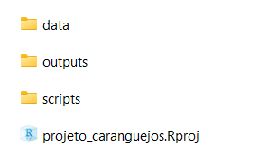

# Como trabalhar no R
  
Se voce ja tem uma nocao de R, mas ainda sente dificuldade de organizar seu fluxo de trabalho, esse capitulo eh pra voce! Utilizaremos tecnicas de ciencia de dados e repositorios como o github para tornar o trabalho no R prazeroso e eficiente!
  
Se voce possuir um banco de dados para analizar a quantidade de parasitas de aves da mata atlantica, ou o comportamento sexual de caranguejos chama-mares (ou seja la qual for o seu estudo), aproveite para utiliza-lo aqui nesse capitulo. Caso voce ainda nao possua seu banco de dados, trabalharemos com algum banco de dados nativo do R. Optei por utilizar o banco de dados "iris", mas sinta-se a vontade para utilizar qualquer outro.

Primeiro vamos exportar o banco de dados iris para que possamos simular todo o precesso desde a sua importacao. Para isso, iremos carregar o banco de dados iris utilizando a funcao *data()*, e utilizaremos a funcao *write.csv()* para exportar, no formato csv, a planilha "iris" para o computador. Deixe essa planilha salva em algum lugar no computador e finja que ela eh sua, mais para frente iremos utiliza-la.

```r

#Carregando pacote de dados iris
data(iris)

#Salvando (exportando) iris no computador
write.csv(x = iris,            #nome do banco de dados do R
          file = "iris.csv",   #nome do banco de dados salvo no computador
          row.names = FALSE)   #Mostrar o nome das linhas na planilha salva utilizando TRUE ou nao utilizando FALSE.
```
  
Para entender a funcao *write.csv()* modifique alguns argumentos:

  - Substitua: file = "iris.csv" por file = "planilha_do_R.csv".
  - Substitua: row.names = FALSE, por row.names = TRUE.
  
Por padrao, iremos utilizar sempre row.names = FALSE.
  
## Criando um projeto de R
  
Imaginemos que precisamos analisar um banco de dados de algum projeto. O primeiro passo eh criar um projeto de R, para isso voce vai no canto superior direito do RStudio (proximo a janela de environment e history) e clica :
  
**project (none)" > new project > new directory > new project**
  
Ao clicar em new project, ira aparecer uma janela para escolher o nome do projeto e o local no computador que seu projeto ira ficar. Coloque o nome desejado (sugestao: "projeto_caranguejo"), selecione qualquer pasta no computador (sugestao: desktop) e clique em "criar projeto".
  
Se voce fez tudo direitinho, o RStudio estara do seguinte forma. Note que ao inves de project (none), estara o nome do projeto que voce criou.
  

  
Sugiro meu nobre consagrado leitor, que voce va no local do computador que voce criou o projeto e veja a pasta, veja o arquivo de R que foi criado. Voce tambem pode fazer isso utilizando a janela de Files, onde mostrara todas as pastas do seu diretorio que, a partir de agora, sera a pasta que o seu arquivo de projeto de R esta situado. Todos os scripts, arquivos e planilhas que voce ira utilizar nas suas analises, ficara dentro da pasta do projeto. Isso significa que vai ficar tudo solto, baguncado? Claro que nao. Iremos criar pastas organizadas onde hospedara cada coisa que iremos trabalhar como por exemplo: dados brutos, dados processados, scripts, outputs, etc. Voce pode criar manualmente, mas porque fariamos isso se temos o R para fazer por nos?
  
## Organizando o projeto de R
  
Para criar as pastas de forma organizada, voce pode fazer manualmente ou utilizando o pacote "here".

```r
install.packages("here")
library(here)
```
  
Apos a instalacao do pacote "here" iremos criar uma funcao que criara as pastas automaticamente no nosso diretorio. Nao se assuste com o script da funcao, ela eh mais simples do que parece e voce nao precisa entende-lo por completo. Apenas rode o codigo para criar a funcao e depois rode o codigo que utiliza a funcao para criar as pastas.
  
Antes de rodar o codigo, certifique-se de que voce esta no projeto de R que voce criou.
  
```r
# Criando funcao para criacao das pastas do projeto
build_project <- function(type = "analysis",
                          temp = TRUE) {
  
  if(type == "analysis"){
    # Data
    dir.create(path = here::here("data"))
    dir.create(path = here::here("data", "raw"))
    dir.create(path = here::here("data", "processed"))
    
    # outputs
    dir.create(path = here::here("outputs"))
    dir.create(path = here::here("outputs", "figures"))
    dir.create(path = here::here("outputs", "tables"))
    if(isTRUE(temp)){
      dir.create(path = here::here("outputs", "temp"))
    }
    
    # scripts
    dir.create(path = here::here("scripts"))
    
    # docs
    #dir.create(path = here::here("docs")) #para criar a pasta docs, so tirar o comentario dessa linha
  }
}

#Utilizando a funcao criada para gerar as pastas
build_project(type = "analysis",
              temp = TRUE) #se FALSE, nao cria a pasta temp.
```
  
  Se tudo ocorreu bem, as pastas estao assim:
  

  
Dentro da pasta data voce encontra as pastas "raw" e "processed". Em outputs voce encontra "figures", "temp" e "tables". Em script, voce encontrara nada (por enquanto). O arquivo com o simbolo do R "projeto_caranguejos.Rproj" eh o seu projeto de R. Voce pode abri-lo (dando duplo clique) toda vez que voce for trabalhar no projeto. Isso abrira o Rstudio ja com o seu projeto aberto e pronto para trabalhar.

  - Feche o RStudio e abra-o novamente dando clique duplo no seu projeto de R.
  
Agora voce tem tudo pronto para comecar a trabalhar com um fluxo de trabalho eficiente e reprodutivel!
  
## Trabalhando em um projeto de R
 
Na pasta **data > raw** voce adiciona sua planilha de dados brutos. Para aqueles que nao possuem nenhum dados, utilize a planilha "iris". O fluxo de trabalho sera o mais simples possivel, mas envolvera etapas essenciais da analise de dados.
  
  **Limpar dados brutos > Realizar analise > Mostrar graficos**
  
Para limpar a planilha de dados brutos, iremos criar um script para isso. Utilizaremos funcoes do pacote dplyr para modificar nome das variaveis, nome dos fatores, analisar dados faltantes, entre outras coisas.
  
### Etapa 1: limpar dados

 Vamos criar um script para limpar nossos dados brutos. Monte o script completo utilizando os codigos que irei fornecendo a seguir copiando e colando no seu RStudio. Assim, a primeira coisa que iremos fazer do script eh seu cabecalho. Utilizaremos os comentarios para criar um cabecalho com as informacoes de titulo, autores e data. 
  
 ```r
 
# Script to load and clean raw data flores iris
# Author: Marilia T. Ericcson
# Data: 2019-11-06

```
  
Apos isso, utilizaremos os comentarios, para organizar o script em topicos fazendo manualmente ou utilizando o atalho: **ctrl + shift + R**. A primeira parte do codigo eh a instalacao dos pacotes que iremos utilizar no processo.
  
```r

# Packages -------------------------------------------------------------
if(!require(dplyr)) install.packages("dplyr") #se o pacote dplyr nao estiver sido instalado, ele sera instalado.
library(dplyr) #carregar pacote

```
Segundo, importamos o banco de dados a ser processado (limpado) utilizando a funcao *read.csv()* e atribuindo (<-) a um objeto que iremos chamar de "dados". Para importar voce so precisa especificar o caminho do diretorio em que o arquivo ta inserido. Como estamos utilizando o projeto de R, o diretorio eh onde o projeto esta. Dessa forma, nao ha necessidade de dizer para o R qual o seu diretorio de trabalho. Logo fica facil importar os dados brutos pois sabemos que ele esta na pasta dados > raw > iris.csv. Dizemos isso para o R utilizando os nomes das pastas separado por barras e por fim, o nome do arquivo (iris) e suas extensao (.csv).


 ```r

# Load data ---------------------------------------------------------------
dados <- read.csv("data/raw/iris.csv")

```
Agora que o banco de dados foi importado, podemos fazer um check up basico utilizando algumas funcoes.
  
```r

# 1. Basic checks --------------------------------------------------------------
nrow(dados)             # How many rows
str(dados)              # Variables classes
attributes(dados)       # Attributres
head(dados)             # First rows
any(duplicated(dados))  # There is any duplicated rows?
any(is.na(dados))       # There are NAs in the data?

```
As vezes os nomes das variaveis nao sao faceis de trabalhar, possuindo espaco, acentos, letras maiusculas e minusculas, e nomes confusos. Alem de complicar o codigo, o nome de algumas variaveis podem bugar o script (caso das acentuacoes de palavras em portugues). Entao vamos mudar o nome das variaveis utilizando a funcao *rename()* do pacote **dplyr**. Iremos deixar os nomes mais faceis de trabalhar, deixando todas as letras minusculas.
  
```r

# 3. Rename columns names-------------------------------------------------------
head(dados)
dados2 <- rename(iris,                         #sua planilha bruta
                 sepal_length = Sepal.Length,  #nomes das variaveis (nome_novo = nome antigo)
                 sepal_width  = Sepal.Width,
                 petal_length = Petal.Length,
                 petal_width  = Petal.Width,
                 species      = Species)
head(dados2)

```
Agora vamos dizer para o R os tipos de nossas variaveis. Um problema muito comum, eh o R nao reconhecer que a variavel categorica, nao possui fatores, mesmo possuindo. Por exemplo, em "iris", temos a variavel categorica 'Species' com seus fatores (setosa, versicolor, virginica). Eh possivel que no seu banco de dados, o R nao reconheca isso, entao vamos utilizar a funcao *levels()* para verificar se o R entendeu quais sao os fatores. Se o R retornar NULL, voce precisa dizer para o R utilizando a funcao *as.factor()*.

```r

# 4. Fix factor variables-------------------------------------------------------
# check factor variable
levels(dados2$species)

# making factor variables
dados2$species <- as.factor(dados2$species) #atribuindo a variavel specie transformada a ela mesma.

# check factor variable
levels(dados2$species)

```

Agora podemos renomear o nome dos fatores de uma variavel categorica utilizando a funcao *recode_factor()*. Nesse processo podemos identificar erros de digitacao que ocorreram durante o planilhamento dos dados. Por exemplo, voce pode ter digitado "Macho", "macho" e "male" na variavel sexo durante o planilhamento. O R vai identificar os tres como sendo fatores diferentes mas na verdade sao o mesmo fator. Portanto eh necessario que seja padronizado.
  
```r
# 4.1 fix species factors

#check factors
levels(dados2$species)

#rename factors
dados2$species <- recode_factor(dados2$species,                 #variavel categorica
                                setosa = "iris_setosa",         #mudando nome setosa para iris_setosa
                                versicolor = "iris_versicolor",
                                virginica = "iris_virginica")

#check factors
levels(dados2$species)

```
  
Agora que limpamos nossos dados brutos, iremos exportar nossa planilha limpa. Perceba que o processo do script eh colocar a planilha bruta de um lado e sair limpa e bonitinha do outro. Eh com os dados processados que iremos trabalhar de fato. Vamos salvar sempre no formato csv por ser um formato mais simples, leve e estavel.
  
```r
# 8. Save processed data -----------------------------------------------------
write.csv(x = dados2,                                 #nome da planilha que voce quer exportar
          file = "data/processed/processed_iris.csv", #local e nome da planilha exportada
          row.names = FALSE)                          #sempre utilizaremos row.names = FALSE

```
  
O processo de manipulacao de dados no R eh bastante completo e existem diferentes formas de limpar seus dados brutos. O pacote **dplyr** possui funcoes capazes de selecionar variaveis, selecionar linhas, criar variaveis, criar subsets, entre outras. Para aprimorar seu script de limpeza de dados, voce precisara aprender sobre manipulacao de dados e incluir no processo, os codigos no seu script. Por sorte, existe muito material disponivel na internet sobre o assunto. Talvez algum dia eu crie um material sobre manipulacao de dados com dplyr, mas aqui esse nao eh meu objetivo. Meu objetivo eh simplesmente fornecer o esqueleto teorico, te dando base para crescer de forma mais direcionada.
  
Por fim, nao esqueca de salvar o script na pasta script com o nome '01_clean_raw_data'.
  
### Etapa 2: fazer analise
  
Com a planilha bruta processada, podemos realizar testes estatisticos para responder nossa hipotese. Vamos supor que nossa pergunta seja saber se existe diferenca entre o tamanho das petalas entre as tres especies. Organizaremos o script de analise de forma similar ao script de limpeza, ou seja, escreveremos um cabecalho, carregaremos pacotes, importaremos e analisaremos dados de forma organizada.
  
Vamos fazer um cabecalho para nosso script de analise.
  
 ```r
 
# Script to load and analyse processed data iris
# Author: Marilia T. Ericcson
# Data: 2019-11-07

```

Vamos criar o codigo para carregar os pacotes que iremos utilizar

 ```r
 
#Carregar pacotes
library(broom)

```
  
Dessa vez iremos importar a planilha limpa e processada. Note que o caminho de importacao eh similar ao caminho que exportamos no script de limpeza.
  
 ```r

# Load data ---------------------------------------------------------------
dados <- read.csv("data/processed/processed_iris.csv")

```
  
Vamos fazer um check basico.

```r

# 1. Basic checks --------------------------------------------------------------
head(dados)
str(dados)
leves(dados$species)

```

Vamos realizar uma analise para comparar a largura das petalas entre as especies. Para isso, iremos utilizar o teste nao parametrico de kruskal-wallis atraves da funcao kruskal.test(). Nessa funcao, voce precisa dizer qual sua variavel numerica de interesse em relacao a (~) sua variavel categorica e seus grupos (fatores). Veja que o p-value eh menor que 0.05, entao dizemos que existe diferenca da largura entre as tres especies.
  
```r

#realizando o teste
kw <- kruskal.test(iris$Sepal.Width ~ iris$Species)
kw

```
   
Vamos salvar o resultado em uma tabela organizada (tidy) utilizando a funcao *tidy()* do pacote **broom**.

```r

#Ajeitando tabela para formato tidy
table_kw <- tidy(kw_test)
table_kw

```

Agora salvaremos essa tabela na nossa pasta outputs em tables.

```r

#Exportando resultado
write.csv(x = table_kw,                                 
          file = "outputs/tables/resultado_kw.csv",
          row.names = FALSE)

```
Maravilha! Ja temos nosso segundo script pronto. Agora eh so salva-lo na pasta script com o nome: '02_kruskal_test'.
  
### Etapa 3: criar grafico
  
Agora vamos criar o grafico para representar nosso resultado de que existe diferenca da largura das petadas entre as especies de iris.
  
```r
 
# Script to load and analyse processed data iris
# Author: Marilia T. Ericcson
# Data: 2019-11-07
 
#Carregar pacotes
library(ggplot2)

# Load data ---------------------------------------------------------------
dados <- read.csv("data/processed/processed_iris.csv")

# 1. Basic checks --------------------------------------------------------------
head(dados)
str(dados)
leves(dados$species)

# 2. Criar grafico boxplot -----------------------------------------------------

grafico <- ggplot(dados, aes(x = species, y = petal_width))+
  geom_boxplot()

grafico

# 3. Salvando grafico ----------------------------------------------------------

ggsave(plot = grafico,    #nome do grafico
       filename = "output/figures/Grafico_boxplot.png", #nome do grafico exportado
       width = 10,                             #largura do grafico
       height = 10,                            #Altura do grafico
       dpi = 300)                              #resolucao do grafico

```

```{r graph, fig.show='asis',fig.cap='ggplot2', echo=FALSE}

#Carregar pacotes
library(ggplot2)
data(iris)

ggplot(iris, aes(x = Species, y = Petal.Width))+
  geom_boxplot()

```
  
Voce acabou de criar um grafico utilizando o pacote ggplot2 que eh o pacote mais utilizado para producao de graficos no R. O codigo pode parecer um pouco confuso no inicio, mas nao precisa estudar muito para perceber que ele eh muito simples e intuitivo. Para aprender mais sobre graficos, sugiro os livros: https://rkabacoff.github.io/datavis/ e https://r-graphics.org/
  
Nao esqueca de salvar o script com o nome '03_grafico'
#Etapa 4: Replicabilidade
  
O seu projeto esta organizado de forma que se torna facil a replicabilidade em qualquer computador gerando todos seus outputs (tabelas e figuras) automaticamente! Para isso, voce precisa manter e JAMAIS deletar ou modificar seus dados brutos (pasta raw). Todos os demais arquivos podem ser produzidos com um click a partir dos seus dados brutos, portanto, podem ser deletados. Isso se torna util ao compartilhar seus dados com alguem, em que voce pode zipar todo seu projeto, enviar para um contribuidor e ele podera ter acesso a tudo rodando apenas um script. Eh esse script que iremos fazer agora.

```r
# Script to run all project code
# Importante: reinicie o R antes de rodar esse script session > restart R

# Start----
# 1. Run all scripts again on a fresh R section---------------------------------
# 1.1 Load and clean data----
source(file = "script/01_clean_raw_data.R")

# 1.2 Run analysis -------------------------------------------------------------
source(file = "script/02_kruskal_test.R")

# 1.3 Plot figures--------------------------------------------------------------
source(file = "script/03_grafico.R")

```
  
Ao rodar esse codigo, todos os seus scripts sao rodados e todos os seus outputs e planilhas processadas sao geradas. Mas lembre, seu dado bruto contido na pasta data/raw, nao pode ser deletada ou modificada.
  
Salve esse script com o nome "run_project".
  

