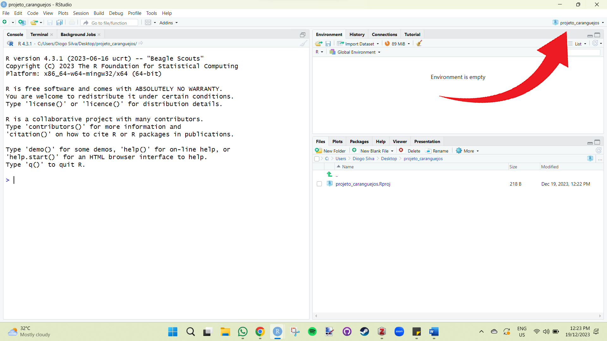

# Como trabalhar no R
  
Se você já tem uma noção de R, mas ainda sente dificuldade em organizar seu fluxo de trabalho, este capítulo é para você! Utilizaremos técnicas de ciência de dados e repositórios como o GitHub para tornar o trabalho no R prazeroso e eficiente!

Iremos utilizar o banco de dados ficticios que possui erros comuns que podemos utilizar para aprender a lidar com eles sem precisar de utilizar o Excel.
  
Baixe a planilha fake e veja que ela possui quatro variaveis (ID, peso, numero de parasitas e local) coletadas do passarinho bem-te-vi.
  
 [Clique aqui para baixar a planilha ficticia](data/fake_data.xlsx)

Vamos importar a planilha fictícia mais para frente. Relaxe aí e finja que ela é sua.
  
## Criando um projeto de R
  
Imaginemos que precisamos analisar um banco de dados de algum projeto. O primeiro passo eh criar um projeto de R, para isso voce vai no canto superior direito do RStudio (proximo a janela de environment e history) e clica:
  
**project (none)" > new project > new directory > new project**
  
Ao clicar em "New Project", aparecerá uma janela para escolher o nome do projeto e o local no computador onde seu projeto irá ficar. Coloque o nome desejado (sugestão: "projeto_caranguejo"), selecione qualquer pasta no computador (sugestão: desktop) e clique em "Criar Projeto".

Se você fez tudo direitinho, o RStudio estará da seguinte forma. Note que ao invés de "Project (None)", estará o nome do projeto que você criou.
  

  
Sugiro, meu nobre consagrado Rzeiro, que você vá no local do computador onde você criou o projeto e veja a pasta, veja o arquivo de R que foi criado. Você também pode fazer isso utilizando a janela de "Files", onde mostrará todas as pastas do seu diretório que, a partir de agora, será a pasta que o seu arquivo de projeto de R está situado. Todos os scripts, arquivos e planilhas que você irá utilizar nas suas análises, ficarão dentro da pasta do projeto. Isso significa que vai ficar tudo solto, bagunçado? Claro que não. Iremos criar pastas organizadas onde hospedarão cada coisa que iremos trabalhar, como por exemplo: dados brutos, dados processados, scripts, outputs, etc. Você pode criar manualmente, mas por que faríamos isso se temos o R para fazer por nós?

## Organizando o projeto de R
  
Para criar as pastas de forma organizada, voce pode fazer manualmente ou utilizando o pacote "here".

```r
install.packages("here")
library(here)
```
  
Após a instalação do pacote "here", iremos criar uma função que criará as pastas automaticamente no nosso diretório. Não se assuste com o script da função, ela é mais simples do que parece e você não precisa entendê-lo por completo. Apenas rode o código para criar a função e depois rode o código que utiliza a função para criar as pastas.

Antes de rodar o código, certifique-se de que você está no projeto de R que você criou.
  
```r
# Criando funcao para criacao das pastas do projeto
# Codigo disponibilizado pelo Gustavo Paterno (https://github.com/paternogbc)

build_project <- function(type = "analysis",
                          temp = TRUE) {
  
  if(type == "analysis"){
    # Data
    dir.create(path = here::here("data"))
    dir.create(path = here::here("data", "raw"))
    dir.create(path = here::here("data", "processed"))
    
    # outputs
    dir.create(path = here::here("outputs"))
    dir.create(path = here::here("outputs", "figures"))
    dir.create(path = here::here("outputs", "tables"))
    if(isTRUE(temp)){
      dir.create(path = here::here("outputs", "temp"))
    }
    
    # scripts
    dir.create(path = here::here("scripts"))
    
    # docs
    #dir.create(path = here::here("docs")) #para criar a pasta docs, so tirar o comentario dessa linha
  }
}

#Utilizando a funcao criada para gerar as pastas
build_project(type = "analysis",
              temp = TRUE) #se FALSE, nao cria a pasta temp.
```
  
  Se tudo ocorreu bem, as pastas estao assim:
  

  
Dentro da pasta "data", você encontra as subpastas "raw" e "processed". Em "outputs", você encontra as subpastas "figures", "temp" e "tables". Em "script", você não encontrará nada (por enquanto). O arquivo com o símbolo do R "projeto_caranguejos.Rproj" é o seu projeto de R. Você pode abri-lo (dando duplo clique) toda vez que você for trabalhar no projeto. Isso abrirá o RStudio já com o seu projeto aberto e pronto para trabalhar.

- Feche o RStudio e abra-o novamente dando clique duplo no seu projeto de R.

Agora você tem tudo pronto para começar a trabalhar com um fluxo de trabalho eficiente e reprodutível!
  
## Trabalhando em um projeto de R
 
Antes de tudo baixe a planilha de dados ficticios (caso nao tenha baixado ainda) de uma especie de passarinho (tambem ficticia), que contem informacoes ficticias sobre peso (g) e quantidade de parasitas de tres diferentes localidades do bem-te-vi:
 
 [Clique aqui para baixar a planilha ficticia](data/fake_data.xlsx)
 
Na pasta **data > raw**, você adiciona sua planilha de dados brutos fictícia (fake_data.xlsx). O fluxo de trabalho será o mais simples possível, mas envolverá etapas essenciais da análise de dados.
  
**Limpar dados brutos > Realizar análise > Mostrar gráficos**
  
Para limpar a planilha de dados brutos, iremos criar um script para isso. Utilizaremos funções do pacote *dplyr* para modificar nomes das variáveis, nomes dos fatores, analisar dados faltantes, entre outras coisas.
  
### Etapa 1: limpar dados

 Vamos criar um script para limpar nossos dados brutos. Monte o script completo utilizando os codigos que irei fornecendo a seguir copiando e colando no seu RStudio. Assim, a primeira coisa que iremos fazer do script eh seu cabecalho. Utilizaremos os comentarios para criar um cabecalho com as informacoes de titulo, autores e data. 
  
 ```r
 
# Script to load and clean raw data flores iris
# Author: Marilia T. Ericcson
# Data: 2019-11-06

```
  
Após isso, utilizaremos os comentários para organizar o script em tópicos, fazendo isso manualmente ou utilizando o atalho: **Ctrl + Shift + R**. A primeira parte do código é a instalação dos pacotes que iremos utilizar no processo.
  
```r

# Packages -------------------------------------------------------------
# Caso nao tenha os pacotes instalados, instale!

library(dplyr)  #Pacote com funcoes para manipular dados
library(readxl) #Pacote com funcao para importar planilha em formato de excel (xlsx)
```
Segundo, importamos o banco de dados a ser processado (limpado) utilizando a função *read.csv()* e atribuindo (<-) a um objeto que iremos chamar de "dados". Para importar, você só precisa especificar o caminho do diretório em que o arquivo está inserido. Como estamos utilizando o projeto de R, o diretório é onde o projeto está. Dessa forma, não há necessidade de dizer para o R qual é o seu diretório de trabalho. Logo, fica fácil importar os dados brutos pois sabemos que ele está na pasta "dados > raw > iris.csv". Dizemos isso para o R utilizando os nomes das pastas separados por barras e, por fim, o nome do arquivo (iris) e sua extensão (.csv).
  

 ```r

# Load data ---------------------------------------------------------------
dados <- read_excel("data/raw/fake_data.xlsx")

```
Agora que o banco de dados foi importado, podemos fazer um check up basico utilizando algumas funcoes. Como assim check up basico? Ver o numero de observacoes, se tem dado faltando ou observacao duplicada, essas coisas.
  
```r

# 1. Check up basico --------------------------------------------------------------
nrow(dados)             # Quantas linhas (observacoes) tem no banco de dados?
str(dados)              # quais as classes das variaveis?
attributes(dados)       # quais atributos?
head(dados)             # Primeiras linhas do banco de dados.
any(duplicated(dados))  # Checar se tem linhas duplicadas.
any(is.na(dados))       # Checar se tem dado faltando (NA).

```
Às vezes, os nomes das variáveis não são fáceis de trabalhar, possuindo espaços, acentos, letras maiúsculas e minúsculas, e nomes confusos. Além de complicar o código, o nome de algumas variáveis pode bugá-lo (caso das acentuações de palavras em português). Então, vamos mudar o nome das variáveis utilizando a função *rename()* do pacote **dplyr**. Iremos deixar os nomes mais fáceis de trabalhar, deixando todas as letras minúsculas.
  
```r

# 3. Renomeando o nome das variaveis -------------------------------------------------------
#ver nome das colunas (variaveis) ----
colnames(dados)

#Renomeando variaveis ----
#Vamos renomear de forma a tirar espacos e manter apenas letras minusculas.
dados_renamed <- rename(dados,           
                        id = ID,  #nomes das variaveis (nome novo = nome antigo)
                        peso_g  = `Peso (g)`,
                        total_parasitas = `Total de parasitas`,
                        local  = Local
                        )
colnames(dados_renamed)

```
  
Note que quando existe espaço, o nome da variável precisa estar entre crases.
Agora vamos dizer para o R os tipos de nossas variáveis. Um problema muito comum é o R não reconhecer que a variável categórica não possui fatores, mesmo possuindo. Por exemplo, em "iris", temos a variável categórica 'Species' com seus fatores (setosa, versicolor, virginica). É possível que no seu banco de dados, o R não reconheça isso, então vamos utilizar a função *levels()* para verificar se o R entendeu quais são os fatores. Se o R retornar NULL, você precisa dizer para o R utilizando a função *as.factor()*.

```r

# 4. Consertar fatores  --------------------------------------------------------
# ver quais fatores estao na variavel local
levels(dados_renamed$local) #Se retornar NULL eh porque nao ta reconhecendo como fator.

# Transformando em fator ----
dados_renamed$local <- as.factor(dados_renamed$local)

# checar fatores
levels(dados_renamed$local)

```

Agora podemos renomear o nome dos fatores de uma variável categórica utilizando a função *recode_factor()*. Nesse processo, podemos identificar erros de digitação que ocorreram durante o planilhamento dos dados. Por exemplo, você pode ter digitado "Macho", "macho" e "male" na variável sexo durante o planilhamento. O R vai identificar os três como sendo fatores diferentes, mas na verdade são o mesmo fator. Portanto, é necessário que seja padronizado.
  
```r
# 4.1 Renomear fatores

#Checar fatores
levels(dados_renamed$local)
```
Veja que aqui deveríamos ter apenas três fatores: floresta, urbano e parque. Mas, devido a erros de digitação, o R entende que são fatores diferentes. Isso é muito comum em planilhas de dados grandes, e você teria que fazer isso manualmente, identificando cada erro. Imagina o trabalhão.

```r
#Renomear fatores
dados_renamed$local <- recode_factor(dados_renamed$local,   #variavel categorica
                                     Floresta = "floresta",         #mudando nome Floresta para floresta
                                     park = "parque",
                                     parque. = "parque",
                                     urban = "urbano",
                                     Urbano = "urbano")

#check factors
levels(dados_renamed$local)

```
Agora sim! Temos os três fatores bonitinhos. Agora que limpamos nossos dados brutos, iremos exportar nossa planilha limpa. Perceba que o processo do script é colocar a planilha bruta de um lado e sair limpa e bonitinha do outro. É com os dados processados que iremos trabalhar de fato. Vamos salvar sempre no formato CSV, por ser um formato mais simples, leve e estável.
  
```r
# 8. Salvar dado processado ----------------------------------------------------
write.csv(x = dados_renamed,    #nome da planilha que voce quer exportar
          file = "data/processed/processed_fake_data.csv", #local e nome da planilha exportada
          row.names = FALSE)  #sempre utilizaremos row.names = FALSE

```
  
O processo de manipulação de dados no R é bastante completo, e existem diferentes formas de limpar seus dados brutos. O pacote **dplyr** possui funções capazes de selecionar variáveis, selecionar linhas, criar variáveis, criar subconjuntos, entre outras. Para aprimorar seu script de limpeza de dados, você precisará aprender sobre manipulação de dados e incluir no processo os códigos no seu script. Por sorte, existe muito material disponível na internet sobre o assunto. Talvez algum dia eu crie um material sobre manipulação de dados com dplyr, mas aqui esse não é meu objetivo. Meu objetivo é simplesmente fornecer o esqueleto teórico, dando base para crescer de forma mais direcionada.

Por fim, não esqueça de salvar o script na pasta script com o nome '01_clean_raw_data'.
  
### Etapa 2: fazer analise
  
Com a planilha bruta processada, podemos realizar testes estatísticos em um novo script para responder à nossa hipótese. Vamos supor que nossa pergunta seja saber se existe diferença na infestação de parasitas em cada local. Organizaremos o script de análise de forma semelhante ao script de limpeza, ou seja, escreveremos um cabeçalho, carregaremos pacotes, importaremos e analisaremos dados de forma organizada.
  
Vamos fazer um cabeçalho para nosso script de análise.
  
 ```r
 
# Script para analisar dados
# Author: seu nome
# Data: 2019-11-07

```
  
Vamos criar o código para carregar os pacotes que iremos utilizar.
  
 ```r
 
#Carregar pacotes
library(broom)

```
   
Dessa vez, iremos importar a planilha limpa e processada. Note que o caminho de importação é similar ao caminho que exportamos no script de limpeza.
  
 ```r

# Load data ---------------------------------------------------------------
dados <- read.csv("data/processed/processed_iris.csv")

```
  
Vamos fazer um check basico.
  
```r

# 1. Check up basico --------------------------------------------------------------
head(dados)
str(dados)
leves(dados$local)

```
  
Vamos realizar uma análise para ver se existe diferença na quantidade de parasitas encontrada nos bem-te-vis de cada local. Para isso, iremos utilizar o teste não paramétrico de Kruskal-Wallis através da função kruskal.test(). Nessa função, você precisa dizer qual sua variável numérica de interesse em relação a (~) sua variável categórica e seus grupos (fatores). Veja que o p-value é menor que 0.05, então dizemos que existe diferença da largura entre as três espécies.
  
```r

#realizando o teste
kw <- kruskal.test(dados$total_parasitas ~ dados$local)
kw

```
   
Vamos salvar o resultado em uma tabela organizada (tidy) utilizando a função *tidy()* do pacote **broom**.
  
```r

#Convertendo tabela para formato tidy
table_kw <- tidy(kw_test)
table_kw

```
  
Agora salvaremos essa tabela na nossa pasta outputs em tables.

```r

#Exportando resultado
write.csv(x = table_kw,                                 
          file = "outputs/tables/resultado_kw.csv",
          row.names = FALSE)

```
  
Maravilha! Já temos nosso segundo script pronto. Agora é só salvá-lo na pasta script com o nome '02_kruskal_test'.
  
### Etapa 3: criar grafico
  
Agora vamos criar o gráfico para representar nosso resultado de que existe diferença na largura das pétalas entre as espécies de iris.
  
```r
 
# Script para criar graficos
# Author: seu nome
# Data: 2019-11-07
 
#Carregar pacotes
library(ggplot2)

# Load data ---------------------------------------------------------------
dados <- read.csv("data/processed/processed_fake_data.csv")

# 1. Basic checks --------------------------------------------------------------
head(dados)
str(dados)
leves(dados$species)

# 2. Criar grafico boxplot -----------------------------------------------------

grafico <- ggplot(dados, aes(x = species, y = petal_width))+
  geom_boxplot()

grafico

# 3. Salvando grafico ----------------------------------------------------------

ggsave(plot = grafico,    #nome do grafico
       filename = "output/figures/Grafico_boxplot.png", #nome do grafico exportado
       width = 10,                             #largura do grafico
       height = 10,                            #Altura do grafico
       dpi = 300)                              #resolucao do grafico

```

```{r graph, fig.show='asis',fig.cap='ggplot2', echo=FALSE}

#Carregar pacotes
library(ggplot2)
data(iris)

ggplot(iris, aes(x = Species, y = Petal.Width))+
  geom_boxplot()

```
  
Você acabou de criar um gráfico utilizando o pacote ggplot2, que é o pacote mais utilizado para produção de gráficos no R. O código pode parecer um pouco confuso no início, mas não precisa estudar muito para perceber que ele é muito simples e intuitivo. Para aprender mais sobre gráficos, sugiro os livros: [Data Visualization: A practical introduction](https://rkabacoff.github.io/datavis/) e [R Graphics Cookbook](https://r-graphics.org/).

Não esqueça de salvar o script com o nome '03_grafico'.

### Etapa 4: Replicabilidade

O seu projeto está organizado de forma que se torna fácil a replicabilidade em qualquer computador, gerando todos seus outputs (tabelas e figuras) automaticamente! Para isso, você precisa manter e **JAMAIS deletar** ou modificar seus dados brutos (pasta raw). Todos os demais arquivos podem ser produzidos com um clique a partir dos seus dados brutos, portanto, podem ser deletados. Isso se torna útil ao compartilhar seus dados com alguém, em que você pode zipar todo seu projeto, enviar para um contribuidor, e ele poderá ter acesso a tudo rodando apenas um script. É esse script que iremos fazer agora.

```r
# Script to run all project code
# Importante: reinicie o R antes de rodar esse script session > restart R

# Start----
# 1. Run all scripts again on a fresh R section---------------------------------
# 1.1 Load and clean data----
source(file = "script/01_clean_raw_data.R")

# 1.2 Run analysis -------------------------------------------------------------
source(file = "script/02_kruskal_test.R")

# 1.3 Plot figures--------------------------------------------------------------
source(file = "script/03_grafico.R")

```
  
Ao rodar este código, todos os seus scripts são executados, e todos os seus outputs e planilhas processadas são gerados. Mas lembre-se, seu dado bruto contido na pasta data/raw não pode ser deletado ou modificado.

Salve este script com o nome "run_project".
  