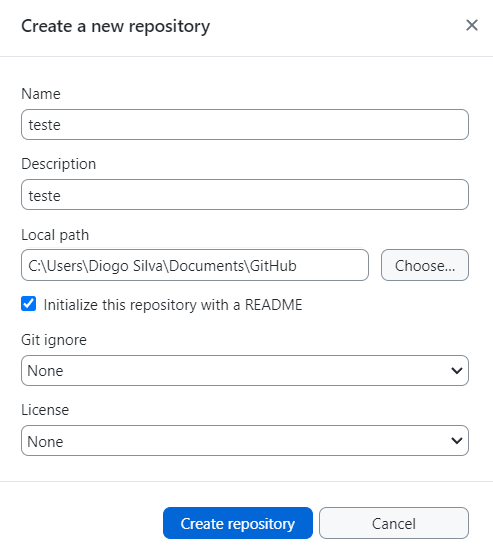
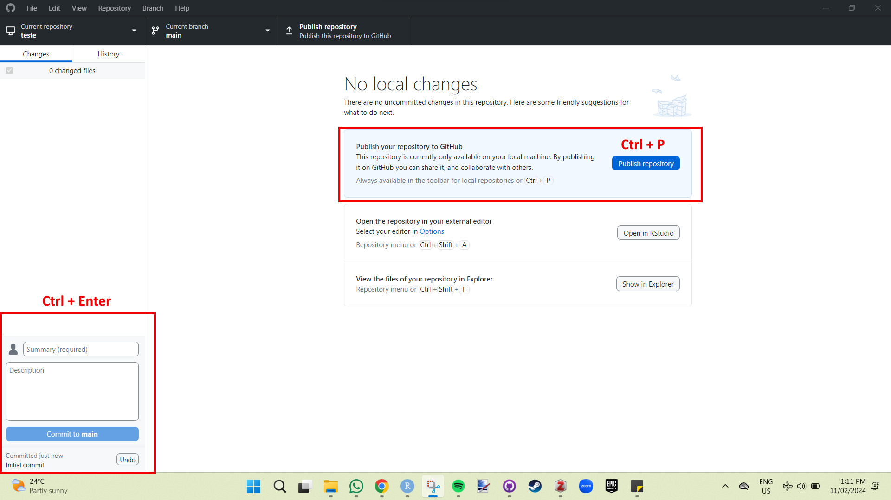

# Git e GitHub (EM DESENVOLVIMENTO)
  
  Para salvar todas as modificações que fizermos no código, iremos armazenar tudo no GitHub. Não só isso, cada modificação será versionada, e poderemos ter de forma organizada todo o histórico do processo de programação do nosso código. Para isso, iremos utilizar a união do Git e GitHub.
  
## O que danado eh isso?
  
**Git**
  
Git é um sistema de controle de versão distribuído gratuitamente que é amplamente utilizado para rastrear as mudanças no código-fonte durante o desenvolvimento de um projeto de programacao. Alem disso, ele permite que várias pessoas trabalhem simultaneamente no mesmo projeto, facilitando a colaboração.
  
Vantagens de utilizar Git:
  
  - **Controle de Versão:** O Git mantém um histórico completo de todas as alterações feitas no código, permitindo que os desenvolvedores revertam para versões anteriores, comparem alterações ao longo do tempo e colaborem de maneira eficiente.

  - **Distribuído:** Cada desenvolvedor tem uma cópia completa do repositório, o que facilita o trabalho offline e a colaboração entre equipes distribuídas geograficamente.

  - **Branching e Merging:** O Git facilita a criação de "branches" (ramificações) para o desenvolvimento de recursos ou correções de bugs sem afetar o código principal. Posteriormente, essas branches podem ser "mescladas" de volta ao código principal.

  - **Rastreamento de Mudanças:** Cada commit no Git é identificado por um código hash único, o que facilita o rastreamento de quem fez cada alteração e quando.

**GitHub**

O GitHub eh como se fosse uma rede social de programadores, uma plataforma online de hospedagem de código-fonte que utiliza o Git para controle de versão. Voce cria seu perfil, pode interagir com outras pessoas, compartilha seus projetos (repositorios), e contribuem para projetos de código aberto (o qual sou altamente favoravel). O GitHub fornece uma interface web para repositórios Git, facilitando a visualização de alterações, gerenciamento de problemas (issues), e integração com várias ferramentas de desenvolvimento.
  
Vantagens de utilizar o GitHub:
  
  - **Colaboração:** Desenvolvedores podem colaborar em projetos, clonar repositórios (algum projeto), propor mudanças no codigo de outras pessoas (pull requests) e discutir alterações com outros colaboradores.
  
  - **Controle de Acesso:** Repositórios no GitHub podem ser públicos (acessíveis a todos) ou privados (acessíveis apenas a membros autorizados da equipe).
  
  - **Gestão de Problemas e Projetos:** O GitHub oferece ferramentas integradas para rastreamento de problemas, gerenciamento de projetos e integração com serviços de automação de construção e teste.
  
  - **GitHub Pages:** Permite a publicação direta de páginas da web a partir de repositórios, facilitando a criação de sites para documentação ou apresentação de projetos.
  
Em resumo, Git é o sistema de controle de versão, enquanto o GitHub é uma plataforma de hospedagem e colaboração baseada no Git, que facilita o trabalho e construcao de codigos em conjunto.
  
## Instalando o Git

Instalar o Git é muito simples. Você só precisa acessar o site oficial (https://git-scm.com/downloads), baixar o programa de acordo com seu sistema operacional e seguir as recomendações padrão para a instalação.

Como este é um material para iniciantes que, provavelmente, nunca programaram na vida, não trarei detalhes sobre o Git. Apenas tenha-o instalado. Trabalharemos principalmente através do GitHub Desktop.

## Criando uma conta no GitHub

Faça sua conta no site https://github.com! São muitas vantagens para um serviço gratuito, então aproveite! Algumas dicas interessantes na hora de criar sua conta são importantes para o seu nome de usuário. Por favor, não coloque nomes de bate-papo UOL. Esta é uma conta que será muito útil profissionalmente, então tenha em mente algumas coisas:

- Use seu nome real! As pessoas querem saber com quem estão lidando.
- Escolha um nome de usuário do qual você não terá vergonha de compartilhar. É sério, tem gente muito doida nesse mundo.
- Use um nome curto, facilita a vida de todo mundo que for ter que lidar com seu perfil, além de ser mais fácil de lembrar.
- Nomes de usuários únicos evitam conflitos, tenha isso em mente caso seu nome seja João Silva.
- Evite colocar informações temporais no seu nome de usuário, como o nome da universidade atual ou empregador. Você não vai querer apresentar seu perfil ao Nordestão com o nome jose-atacadao.
- Use hifens para separar palavras (por exemplo: joao-guilherme).

Há muitas dicas, mas não se estresse demais. É possível mudar de nome depois.

## GitHub Desktop
  
Agora, você irá instalar o GitHub Desktop através do site: https://desktop.github.com/! Este programa facilitará muito a vida de quem não está acostumado a programar. Todos os comandos de criação de repositório, commits e upload para o GitHub que seriam feitos pelo Git através de linhas de comando serão facilitados através de uma interface amigável e clicável.
  
Após a instalação, você só precisará fazer login com sua conta do GitHub. Para isso, abra o programa, vá em "**File**" > "**Options**" > "**Accounts**". Adicione sua conta e seja feliz.
  
##  Criando um repositorio
  
Para que toda modificacao que realizamos no codigo seja salvo na nuvem e de forma versionada. Precisamos criar um repositorio para nosso projeto de R. Que nada mais eh do que uma pasta reconhecida pelo Git. Criaremos esse repositorio (pasta) utilizando o Github Desktop. Primeiro, certifique-se de que voce logou sua conta do GitHub no Github desktop.
  
Abra o Github desktop, va em **Files** > **New repository**. Coloque o nome do repositorio (e.g. projeto_mestrado), uma descricao dizendo sobre o que eh o repositorio (e.g. Analise dos dados do mestrado), marque para criar um READ.ME e crie o repositorio. 
  

  
Apos criar o repositorio, voce precisa publicar no GitHub online, que eh apenas clicar em Publish repository (ou apertar o atalho Ctrl + P).
  


Pronto, voce criou o repositorio e agora esta conectado ao Github online! Todas as modificacoes que voce fizer dentro desse repositorio, sera rastreada pelo git. Toda modificacao que for feita voce precisa manualmente enviar para o github online. Mas pera, a gente criou o repositorio, mas nao colocamos nada la dentro ainda. Pegue seu projeto de R junto com todas as pastas e scripts e tudo mais que foi feito ate agora, e coloque dentro do seu repositorio. Abra o github desktop e voce vai ver que ele detectou os arquivos adicionados, porem para ele ir pra nuvem do Github online, voce precisa enviar, e esse envio eh feito atraves do que chamamos de commit (canto inferior esquerdo do github desktop), de um titulo e faca o commit, depois publique (pull). O comando eh sempre esse, commit (ctrl + enter) depois pull (ctrl + P).
  
Com seu projeto de R sendo rastreado pelo Git e salvo online pelo GitHub, voce agora pode compartilhar e trabalhar em conjunto com outras pessoas.
  Abra o Github e veja seus repositorios, voce vai ver que esta tudo la. Voce pode fazer alteracoes no codito atraves do proprio Github online. Essas alteracoes serao detectadas pelo github desktop, e o processo inverso precisara ser feito (ao inves de modificacoes no computador ir para o online, as modificacoes online irao ir para o computador).
  
# Funções Avançadas

## ifelse()

## for()

## while()

# Criando Funções

Eh possivel que em algum momento nao conhecamos ou nao exista nenhuma funcao para resolver nossos problema. Nesse caso voce pode criar sua propria funcao.
  
## Estrutura de uma Função

name <- function(variables) {
    
}

## Criando uma Função Simples

Se a gente quisesse calcular quanto a gente ganha por ano baseado no nosso salario por mes, basta multiplicar nosso salario por 12, certo?

```r
#Calculo do ganho por ano baseado num salario mensal de 1500 reais.
1500 * 12
```
Mas toda vez que quisermos calcular, precisamos fazer esse calculo. Eu nao quero ter que pensar, quero apenas colocar o valor do meu salario e ter o valor do ganho anual. Vamos criar uma funcao para isso. Esse eh o exemplo de funcao mais simples que consegui imaginar.
  
Vamos criar uma funcao que calcula quanto voce ganha em 1 ano (12 meses), baseado no seu salario mensal. Vamos supor que voce ganha 1500 reais por mes. Para saber quanto voce ganha em um ano, basta apenas multiplicar por 12. Entao vamos criar uma funcao que ira fazer isso para a gente. A funcao recebera quanto voce ganha por mes, calculara por debaixo dos panos, e te dara apenas o resultado. O nome da nossa funcao sera salario_ano, a variavel que ela recebera dentro dos parenteses, nesse caso sera o salario por mes (um numero), entao chamamos esse argumento de salario_mes. Dentro das chaves, ocorrera o processo do argumento. Nesse caso, ocorre apenas a multiplicacao por 12. Simples assim.
  
```r
#Criando funcao
salario_ano <- function(salario_mes) {
  
salario_mes * 12

}

#usando a funcao criada
salario_ano(1500) #o resultado eh os 1500 multiplicado por 12 (salario por ano).
```
  
Voce pode colocar qualquer numero dentro da funcao e ele ira te dar o resultado. Voce deve ta pensando duas coisas nesse momento...

  - Primeiro pensamento:
    Que lezeira hein, tanto trabalho so para calcular um negocio simples desses.
    
  - Segundo pensamento:
    Que massa!!! Imagina quanta coisa massa e complexa que da pra fazer usando funcoes incriveis.
    
  Eu espero que voce tenha tido o segundo pensamento, mas caso tenha tido o pensamento 1, sinto te desapontar mas iremos criar outra funcao leza que nao sereve para nada, mas agora com duas variaveis.
  
  Imagine que queremos uma funcao para somar dois numeros qualquer. Sim, so isso.
  Para essa funcao, precisamos de dois argumentos que serao dois numeros qualquer. Chamei arbitrariamente esses dois numeros de x e y, que na funcao sao separados por virgula. O processo dessa funcao eh apenas a soma dos dois numeros.
  
  ```r
#Criando funcao de somar
soma <- function(x, y) {
  
x + y

}

#usando a funcao soma
soma(1423, 1235)
```
 Voce pode criar funcoes utilizando quantos argumentos quiser. Mas agora vamos criar uma funcao que fornece teu ganho, nao apenas anual, mas sim, semanal, por dia, anual mas que o retorno do resultado seja uma tabela.
 
```r
 salarios <- function(salario_mes) {
  
mes <- salario_mes

}

```
# Criando Pacotes
