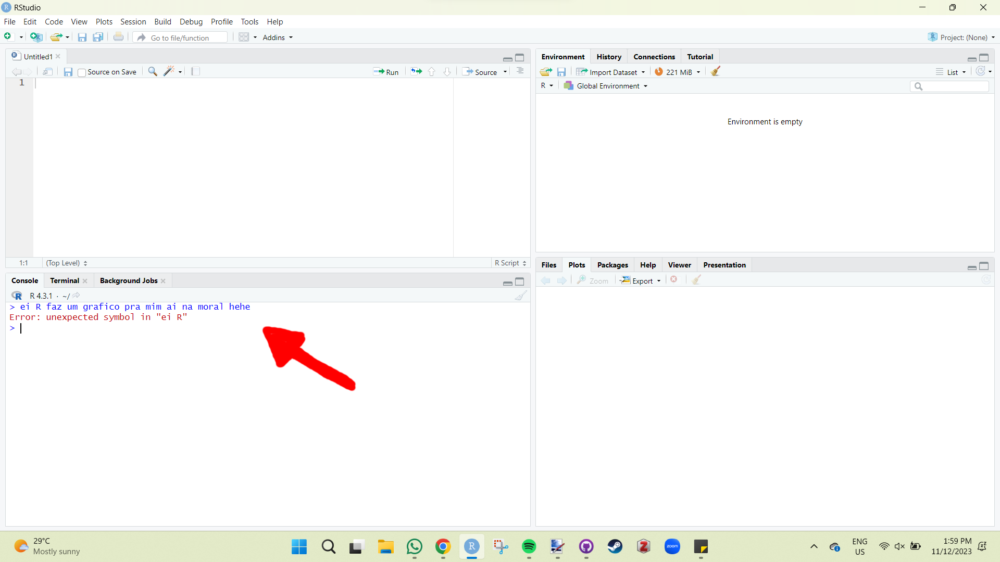

--- 
title: "R Zero - do simples ao complexo"
author: "Diogo J. A. Silva"
date: "`r Sys.Date()`"
site: bookdown::bookdown_site
documentclass: book
bibliography: [book.bib]
# url: your book url like https://bookdown.org/yihui/bookdown
# cover-image: path to the social sharing image like images/cover.jpg
description: |
  This is a minimal example of using the bookdown package to write a book.
  The HTML output format for this example is bookdown::gitbook,
  set in the _output.yml file.
link-citations: yes
github-repo: rstudio/bookdown-demo
---

# Bem-vindos


Esse livro foi criado para organizar, de forma fácil, os códigos dos tipos de gráficos que podem ser criados utilizando o R, trazendo um compilado essencial da Visualização de dados. Claro que já existem livros muito bons sobre o assunto (https://rkabacoff.github.io/datavis/ e https://r-graphics.org/), porém são livros em inglês e pouco amigáveis para iniciantes. Claro que existe um livro muito bom em português e serve para iniciantes (https://analises-ecologicas.netlify.app/), mas não é focado em visualização de dados. Portanto, nesse livro, iniciantes terão uma boa base introdutória no R e serão direcionados para a visualização de dados de forma mais simples e organizada.

Neste livro, você encontrará o essencial para produzir gráficos em R utilizando o pacote ggplot2. Para o melhor aproveitamento do conteúdo, você precisará entender como o R funciona e também compreender de forma clara os conceitos de variáveis estatísticas (ou seja, variável nominal, quantitativa, etc.). Com isso em mente, você poderá pular para qualquer parte do livro e aproveitar seu conteúdo, que se mostrará independente caso você tenha todos os pré-requisitos (ou seja, R + RStudio instalados).

Se você já possui os conhecimentos básicos de estatística e R, sinta-se livre para pular para qualquer parte do livro e aproveitar os códigos dos gráficos. :)
  

<!--chapter:end:index.Rmd-->

# Pre-requisitos

## Instalando R e RStudio
Para você usar esse livro de forma otimizada, precisará ter o R e RStudio instalados. Nem vou falar sobre a instalação, pois sei que você é capaz de encontrar um tutorial feito por uma criança de 8 anos no YouTube.
  
Se voce eh um completo iniciante, a forma ideal de utilizar esse livro, eh seguir o que o livro pede executando os comandos no RStudio.

<!--chapter:end:01-intro.Rmd-->

# R para iniciantes

Caro iniciante, meu objetivo aqui é mostrar que utilizar o R é muito divertido e recompensador. Você vai perceber que cada código rodado (e que funciona) vai te dar um pouquinho de dopamina e uma sensação de prazer. Claro que alguns erros vão te deixar maluco, mas você vai perceber que tudo é culpa sua. Mas não se preocupe, se é culpa sua, você pode consertá-los facilmente :)

A tendência é que quanto mais você utiliza o R, mais fácil sua vida se torna, e apesar da curva de aprendizagem ser um pouco desestimuladora, é 1000 vezes recompensadora. Como alguns gostam de dizer, você conseguirá fazer um gráfico até 30 vezes mais rápido!!! Não sei de onde veio esse cálculo, mas se está na internet é verdade.

## Entendendo o RStudio

Tudo que iremos fazer será através do R Studio devido à organização que ele nos fornece. Ao abrir o R Studio, você verá o seguinte:


Não tem a aparência convencional dos programas estatísticos, mas isso acontece porque não se realizam tarefas clicando em abas ou botões. No R Studio, você executa comandos por meio de códigos! No futuro, é provável que exista um programa com o qual você poderá conversar em qualquer idioma e ele realizará as tarefas que você pedir. Até onde sei, ainda não existe nenhum programa com a precisão do R. No entanto, para utilizar o R, é necessário falar a linguagem dele.

Se voce for "falar" diretamente com o R no console e digitar e apertar o botao "Enter" do teclado: *"Ei R, faz um grafico pra mim ai na moral hehe"*. Ele vai te retornar um erro em vermelho. 



Ele está basicamente indicando que não entendeu o que você disse. Vamos tentar usar a linguagem dele. Digite: **1 + 1**

Você vai notar que ele retornará o resultado **2**. Você pode realizar qualquer operação matemática, desde que utilize uma linguagem que ele possa compreender.

  **2+2 (soma)**  
  **2-2 (subtração)**  
 **2\*2 (multiplicação)**  
  __2/2 (divisão)__    
  __2^2 (potenciação)__ 
  
Agora digite uma equacao mais complexa:

__2+2-2^2/2__
  
O resultado sera __2__. Mas e se voce quiser mudar? Trocar a raiz quadrada de 10 (sqrt(10)) para a raiz quadrada de 4 (sqrt(4))? Voce vai ter que digitar tudo de novo? De fato, sim, vai ter que digitar tudo de novo, porem voce pode usar a tecla "seta para cima" do teclado, e ele vai te mostrando os ultimos comando dados.

Mas eh por essa falta de praticidade de conversar com o R, que o R studio ganha sua importancia na janela de Script.

Vamos criar um pequeno script e aprender algumas coisas. Copie o codigo abaixo e cole na janela de script.

```r
# Mini Script  
a <- 1  
b <- 2  
a + b
```
  
Veja que no Script, o documento eh organizado por linhas (1, 2, 3, 4...). Nesse caso, cada linha representa um comando. Com excesao da linha 1 que eh na verdade um comentario ou uma nota. Qualquer codigo pode ser transformado em um comentario, para isso, eh so adicionar o **#** no inicio da linha. Comentarios, nao sao comandos, e se voce tentar executa-los, automaticamente irao pular e executar a proxima linha.
  
Para executar um comando no script nao utilizamos apenas o "Enter" e sim o "Ctrl + Enter". Ao executar a segunda linha **a <- 1**, voce pediu para o R atribuir o numero **1** a letra **a**. Ao executar a terceira linha, voce atribui o numero **2** a letra **b**. E por fim, ao executar a quarta linha, voce realiza uma soma de **a + b**, ou seja **1 + 2**.
  
Voce ja deve ter percebido que o codigo **<-** significa **atribuir**.
  
*Nesse momento, nobre leitor, eu espero que voce esteja realizando diferentes operacoes matematicas, utilizando diferentes atribuicoes.*

Vamos continuar! Um objeto pode possuir mais de um valor ao mesmo tempo. Vamos fazer uma atribuicao chamada de **v** e outro chamado de **V**. Note que para o R, o v minusculo e V maiusculo sao coisas diferentes. Muitos erros acontecem por causa desse pequeno detalhe. Vamos realizar essas atribuicoes com o codigo abaixo:

```r
v <- c(2,4,10)  
V <- c(4,8,20)

```
  
Note que para fazer uma atribuicao de muitos valores, eles precisam estar entre parenteses, separados por virgula antecedidos do **c**.
  
## Objetos, vetores e funções

Dando nome aos bois! Entender que cada parte e cada coisa que voce faz possui uma nomeclatura, ajuda voce a se comunicar com outros, seja lendo um livro, seja assistindo um video ou conversando com um colega sobre R. Entao vamos entender alguns conceitos.
  
### Objetos
  
Quando atribuimos o numero **1** a letra **a**, a gente criou um objeto de nome **a**. Abaixo mais alguns exemplos de objetos.
  
  ```r
objeto_a <- 10
objeto_b <- 20
melhor_comida <- "Coxinha de frango!"
Brasil <- "Pentacampeao!"
Marilia <- "Troxa!"

```
Note que eh possivel atribuir letras, caracteres ou frases a um objeto. Mas eh necessario que o conteudo esteja entre aspas.
 
Toda vez que voce executa o objeto, o R ira retornar seu valor correspondente. Execute os objetos um por um e veja o resultado.
  
  ```r
objeto_a
objeto_b
melhor_comida
Brasil
Marilia

```
  
### Vetores
  
Os objetos com multiplos valores de um mesmo tipo sao chamados de vetores.
  
  ```r
vetor.A <-c (10, 20, 30)
vetor.B <-c (2, 2, 2)
melhores.comidas <-c ("coxinha","pastel","lasanha")
  
vetor.A
vetor.B
melhores.comidas

```
  
### Funções
  
No R, as funcoes servem para processar de alguma forma os dados. No codigo abaixo, vamos criar dois objetos e utilizar a funcao de adicao para soma-los.

  ```r
#Objetos
a <- 2
b <- 8
vetor <- c(5,5,10)

#Funcao de soma
sum(a,b)
sum(vetor)

```
  
Existem funcoes dentro do R para todo tipo de coisa! Vamos criar um conjunto de dados e fazer alguns calculos utilizando algumas funcoes.

  ```r
#Notas do terceiro ano A
notas <- c(7, 8, 10, 5, 2, 4, 6.6, 7.9, 8.9, 0)

#Qual a media da turma?
mean(notas)

#Qual a mediana?
median(notas)

#Qual o desvio padrao das notas?
sd(notas)

#Qual a menor e a maior nota?
min(notas)
max(notas)

#resumo das notas
summary(notas)

```
  
Cada uma dessas funcoes realiza algum calculo em especifico, no caso de *summary()*, ela realiza o calculo da media, mediana, maximo, minimo e quartis, tudo ao mesmo tempo. Talvez em algum momento voce nao encontre a funcao que voce precisa para determinada tarefa, nesse caso, voce pode criar sua propria funcao! Voce pode criar uma funcao utilizando outras funcoes, para fazer algo especifico para voce.
  
Vamos imaginar que voce precise criar uma funcao para somar dois numeros. Eu sei, eh uma funcao simples, mas vai nos ajudar a entender a estrutura de uma funcao. Para criar uma funcao, precisamos utilizar a funcao chamada de *function()*.
  
```r
#Estrutura de uma funcao
nome <- function(variables) {
    
    #dentro das chaves adicionamos o processo que queremos realizar.
    #Nesse caso, somar dois numeros.
}

#Criando a funcao soma

soma <- function(primeiro_numero, segundo_numero) {

add <- primeiro_numero + segundo_numero
print(add)

}
```
  
Essa eh uma funcao que possui dois argumentos (primeiro_numero, segundo_numero) e utilizando esses argumentos ela realiza um calculo de soma e atribui esse resultado a um objeto que chamamos de "add". Por fim, utilizamos a funcao *print()* para mostrar o valor embutido em "add".
  
Agora, vamos imaginar que talvez a funcao *summary()* nao seja o que voce precisa. Voce precisa mesmo eh de uma funcao que te forneca, media, mediana e desvio padrao dos seus dados.
 
Nesse caso, podemos criar a funcao *my_summary()* utilizando a funcao *function()*.
  
  ```r
#Criando a funcao my_summary()

my_summary <- function(vetor) {

media   <- mean(vetor)
mediana <- median(vetor)
desvio  <- sd(vetor)

resultado <- c(media, mediana, desvio)
print(resultado)

}

```
 
Calma, tem muita coisa ai, mas eh tudo o que a gente ja sabe. Na funcao *my_summary()*, precisamos inserir apenas um argumento do tipo vetor, como por exemplo, "notas". Mais uma vez, as chaves que abre e fecha contem tudo o que a gente quer que a funcao realize, linha por linha. Primeiro, queremos que a nossa funcao calcule a media e atribua o resultado a um objeto chamado "media". Segundo, calcular a mediana e atribuir o resultado a um objeto chamado "mediana", depois o desvio. Depois criamos um vetor chamado de "resultado" que armazena os objetos "media", "mediana" e "desvio". Em seguida, pedimos para o R nos mostrar os valores desse vetor "resultado" utilizando a funcao *print()*.
  
Vamos usar nossa funcao personalizada para calcular nosso objeto "notas".
  
  ```r
#Usando a funcao my_function()

my_function(notas)

```
  
Veja que a funcao retornou os valores do nosso vetor, mas apenas isso. Mais para frente, a gente ve como criar funcoes mais elaboradas.

## Tabela de dados
 
### Data frame
Data frame nada mais eh do que uma tabela de dados. Vamos direto ao que interessa e usar a funcao *data.frame()* para criar uma tabela. Iremos criar as notas de 10 alunos e seus respectivos nomes. Se voce ainda estiver na mesma sessao de R, podemos ver que o objeto "notas" ainda esta salvo na janela 3 (Environment e History) e podemos aproveita-lo. De qualquer forma vou recriar "notas", caso por algum motivo voce SAIU do R, um absurdo, mas acontece.

  ```r
#Criando um data frame contendo as notas e os nomes de cada aluno

#Primeiro criamos as notas
notas <- c(7, 8, 10, 5, 2, 4, 6.6, 7.9, 8.9, 0) 

#Segundo criamos os nomes
nomes <- c("Marilia", "Jonatas", "Guilherme", "Camila", 
"Fiuza", "Brunno", "Diego", "Mathews", "Biny", "Rebecca")

#Terceiro utilizamos a funcao data.frame() para criar a tabela
tabela <- data.frame(nomes, notas)
tabela
```
  
Esse data.frame (tabela), eh uma forma muito simplificada das tabelas que iremos importar de nossos dados reais. Porem, ela nos serve muito bem para entendermos como funciona uma planilha no R.
  
A partir de agora eu quero que voce perceba uma coisa muito importante e leve isso para a vida. Uma planilha organizada deve ser construida da seguinte forma:

  -Variaveis sao colunas;
  -Observacoes sao linhas;
  -Cada valor na sua celula.
  
Com essa formatacao de planilha, voce consegue fazer quase tudo no R, utilizando pacotes como 'dplyr' e 'ggplot2', para manipulacao de dados e construcao de graficos, respectivamente.
 
Logo, para voce acessar uma variavel de uma tabela, voce pode usar o **$** da seguinte forma:

  ```r
#Acessando uma variavel

tabela$nomes
tabela$notas

```

Perceba que quando voce digita tabela$ voce pode apertar a tecla TAB para mostrar e selecionar as variaveis de sua tabela. Caso alguma nota esteja errada e voce queira corrigi-la, voce pode utilizar a funcao *fix()*. Essa funcao abre uma janela onde voce pode clicar e modificar o valor desejado.
  
  ```r

fix(tabela)

```
  
Agora sabendo como acessar as variaveis de uma tabela, voce pode utilizar funcoes para calcular uma variavel especifica do data frame.

  ```r

summary(tabela$notas)

```

### Planilha de dados nativa do R
O R possui um banco de dados que nos fornece algumas tabelas de estudo reais o quais podemos utilizar para treinar nossas habilidades. Para isso, precisamos dizer para o R qual banco de dados queremos invocar utilizando a funcao *data()*.

  ```r
#Importando o banco de dados do R
data(iris)

#Funcoes exploratorias
head(iris) #Mostra a parte de cima da planilha 
tail(iris) #Mostra a parte de baixo
str(iris)  #Mostra os tipos de variaveis

```
  
Veja que ao usarmos a funcao *str()* o R retorna a natureza das variaveis da planilha. 

  -num significa numerica.
  -Factor significa que eh uma variavel qualitativa com fatores (setosa,     versicolor, virginica).
  
As vezes a planilha eh importada com as variaveis mal formatadas e isso pode gerar problemas de reconhecimento por parte do R. Nesse caso, eh sempre interessante realizar a verificacao dos dados utilizando a funcao *str()* ou outras funcoes similares. Caso o R nao esteja identificando as variaveis corretamente, duas funcoes muito uteis podem ser utilizadas: *as.numeric()* e *as.factor()*.

  ```r
data(iris)
  
#Convertendo variavel para numerica
iris$Sepal.Length <- as.numeric(iris$Sepal.Length)

#Convertendo variavel para fator
iris$Species <- as.factor(iris$Species)

```
Basicamente voce ta transformando em numerica a variavel Sepal length da planilha iris e atribuindo a ela mesma. Dessa forma, voce faz a alteracao de forma permanente. A mesma coisa ocorre com as.factor.
  
Vamos brincar um pouco com a planilha iris. Primeiro veja que ela esta construida de forma organizada (variaveis nas colunas, observacoes nas linhas, cada celula um valor). Podemos entao realizar o summary() para saber a media, mediana, maximo e minimo da largura da petala (Petal.Width).
  
  ```r
summary(iris$Petal.Width)

```

Porem note que existe 3 especies diferentes. A funcao *summary()* nao leva isso em consideracao. O ideal seria calcular o *summary()* para cada especie. Para isso temos uma funcao muito legal chamada *tapply()*, onde: o primeiro argumento eh a variavel numerica, o segundo a variavel com os fatores, e o terceiro argumento eh a funcao que voce quer aplicar.
 
  ```r
tapply(iris$Petal.Width, iris$Species, summary)

```
  
### Importando sua planilha

No RStudio podemos importar uma planilha do formato excel (xlsx) utilizando o botao na janela Environment (superior direita):

  Environment > Import Dataset > From excel
  
Acho pouco eficiente ensinar a importar dados de um diretorio, acho pouco pratico, uma vez que temos o botao de importar. Ao inves disso, irei treina-lo a utilizar projetos de R reprodutiveis e organizados. Ao trabalhar no R, voce seguira um protocolo basico de como tratar os dados a serem analisados. Ao longo do tempo, voce sera capaz de otimizar esse protocolo e aplicar para quase todo tipo de dado que voce possuir. De qualquer forma, saiba que o R trabalha com uma pasta especifica chamada de diretorio, e para saber qual eh o seu diretorio padrao, utilize a funcao *getwd()*:

  ```r
getwd()

```

Ao executar esse funcao, o R te retornara o caminho da pasta do diretorio padrao atual que provavelmente eh a pasta "documentos" do seu computador.

## Graficos

Agora comeca a parte divertida! A visualizacao de dados no R tem um potencial quase infinito devido as sua grande capacidade de personalizar cada pedacinho da figura.

### Grafico de histograma

Esse grafico nos mostra a frequencia dos valores da variavel de interesse, como por exemplo comprimento da petala das flores do banco de dados iris.

```{r nome-do-chunk1, fig.show='asis', fig.cap='Gráficos com R base'}

#Importando banco de dados "iris"
data(iris)

#Criando histograma
hist(iris$Sepal.Length)
```

Simples nao eh? Mas podemos modificar ainda mais nosso grafico. Alterar cores, nomes dos eixos, titulo, etc. Vamos ver mais argumentos com o grafico de dispersao de pontos.
  
### Grafico de dispersao

Esse grafico nos mostra a relacao entre duas variaveis continuas. Vamos utilizar o banco de dados "iris" para construir e visualizar alguns graficos. Para construir um grafico de dispersao utilizamos a funcao  *plot()*. Note que a funcao plot, possui varios argumentos que podemos ir adicionando para personalizar o grafico. Alem disso, para deixar o codigo mais organizado, sempre apos a virgula de um argumento, pulamos a linha, de forma que cada argumento fique numa linha.

```{r nome-do-chunk2, fig.show='asis', fig.cap='Gráficos com R base'}
  
#Cria o grafico basico
plot(iris$Sepal.Width, iris$Petal.Width)

#adiciona o argumento para mudar o nome do eixo y
plot(iris$Sepal.Width, iris$Petal.Width, 
     ylab = "Petal Width")

#adiciona o argumento para mudar o nome do eixo x
plot(iris$Sepal.Width, iris$Petal.Width, 
     ylab = "Petal Width", 
     xlab = "Sepal Width"
     )

#argumento para mudar a cor dos pontos
plot(iris$Sepal.Width, iris$Petal.Width, 
     ylab = "Petal Width", 
     xlab = "Sepal Width",
     col = "blue"
     )
     
#argumento para mudar o formato dos pontos
plot(iris$Sepal.Width, iris$Petal.Width, 
     ylab = "Petal Width", 
     xlab = "Sepal Width",
     col = 3,
     pch = 2
     )
     
#argumento para adicionar um titulo no grafico
plot(iris$Sepal.Width, iris$Petal.Width, 
     ylab = "Petal Width", 
     xlab = "Sepal Width",
     col = 3,
     pch = 2,
     main = "Titulo do grafico"
     )
     
```

### Grafico boxplot
  
Para criar o grafico de boxplot, iremos utilizar a variavel numerica Sepal.Width do banco de dados iris em relacao a variavel Species. Note que na funcao plot, as duas variaveis (argumentos) eram separados por virgula, aqui utilizamos o **~** para relacionar a variavel numerica com a categorica.
  
  ```{r 3_basic_boxplot, fig.show='asis', fig.cap='Boxplot com R base utilizando o banco de dados iris'}
  
#Importa o banco de dados iris
data(iris)

#Cria o grafico de boxplot basico
boxplot(iris$Sepal.Width ~ iris$Species)

#Boxplot personalizado
boxplot(iris$Sepal.Width ~ iris$Species,
        ylab = "Petal Width", 
        xlab = "Species",
        col = c(3,4,"tomato"),
        main = "Titulo do grafico"
        )

```

Perceba que o argumento col pode ser um vetor, e pode receber mais de um valor. Nesse caso, demos uma cor para cada fator de Species. Tente substituir os numeros por outros, ou colocar o nome das principais cores como: red, green, blue, yellow... So nao esqueca de colocar entre aspas.

### Grafico de barras
  
Para criar um grafico de barras de contagem, vamos criar nosso proprio data frame. Imagine que queremos tabular a contagem total de ectoparasitas (piolho) de ave de cada parte corporal. Como eh algo simples, podemos criar direto no R.

```{r 4_basic_hist, fig.show='asis', fig.cap='Grafico de barras de contagem com R base utilizando banco de dados criado'}

#Criando quantidade total de parasitas
qt_parasita <- c(10, 15, 29, 4)

#Criando parte corporal da ave
parte_corporal <- c("cabeca", "asa", "barriga", "cauda")

#Criando tabela
dados_parasita <- data.frame(qt_parasita, parte_corporal)

# Cria ndo gráfico de barras
grafico <- barplot(dados_parasita$qt_parasita, 
                   names.arg = dados_parasita$parte_corporal,
                   xlab = "Parte do Corpo",
                   ylab = "Quantidade de Parasitas",
                   ylim = c(0,35), #define o limite do eixo y (de 0 a 35)
                   col = "lightgreen",
                   border = "black")

# Adicionando os números acima das barras
text(grafico, dados_parasita$qt_parasita, 
labels = dados_parasita$qt_parasita, pos = 3, cex = 0.8)

```
Faca as seguintes modificacoes no codigo e veja o que acontece:
  
-  Veja o que acontece se voce deletar a linha completa do argumento names.arg.  
-  Troque o valor 35 de ylim por 50.  
-  No argumento border, troque "black" por "red" e depois "white".  
-  Na funcao text(), troque pos = 3, por pos = 1.  
  (rode o grafico antes para nao sobrepor os numeros)
  
Eh possivel fazer muitos outros tipos de graficos, utilizando diferentes funcoes. Mas a ideia desse capitulo eh ensinar a utilizar o R, e nao a criar graficos. Entao vamos com calma, pois quando voce pensar que nao, ja foi.

## Pacotes
  
Agora ja podemos comecar a expandir nosso universo do R. Tudo que fizemos ate agora foi utilizando o proprio R base. A partir de agora, iremos incluir um conjunto de novas funcoes atraves dos pacotes de R. 
Antes de tudo, precisamos instalar o pacote que queremos utilizar, e para isso existe duas formas: 
  
  -  Utilizando o botao *Tools* do RStudio.  
  -  Utilizando a funcao *install.packages("nome_do_pacote")*  
  
Vamos instalar o pacote "lattice" para criarmos uns graficos diferentes do que fizemos anteriormente.
  
Utilizando o botao *Tools* do RStudio click em: **Tools > Install package > digite o nome "lattice".** Ao comecar a digitar o R ira sugerir opcoes de pacotes com as iniciais que voce digitou. Depois clica em "instalar".
  
Utilizando a funcao *install.packages()*

```r
install.packages("lattice")
```
  
O processo de instalacao mostra no console varios processos e enquanto isso acontece, um icone de "stop" vermelho aparece na parte superior direita da janela do console. O processo so termina quando esse icone some e um aviso aparece:  

  
  
Pacote instalado, agora eh so dizer que queremos utilizar o pacote. O processo de instalacao em um determinado computador so precisa ser feito uma vez. Porem, toda vez, voce precisa dizer para o R, qual pacote voce estar utilizando. Para isso utilizamos a funcao *library()*.

```r
#Carregando o pacote lattice
library(lattice)

```
Se voce carregou o pacote e o R nao te retornou nenhum erro, ta tudo certo. As vezes ele te retorna um Warning message, tambem esta tudo certo. Vamos adiante.
  
O pacote lattice que acabamos de instalar nos fornece varias funcoes para criacao de graficos. Tenha em mente que existem milhares de pacotes cada um trazendo um conjunto de funcoes e banco de dados de diferentes contextos, tanto para criar graficos, quanto para realizar modelos estatisticos avancados.
  
Vamos criar alguns graficos utilizando as funcoes que o pacote lattice nos forneceu.
  
```{r nome-do-chunk, fig.show='asis', fig.cap='Gráficos com Lattice'}
#Se o pacote já estiver instalado, você só precisa carregar o pacote
library(lattice) 

# Gráfico de dispersão condicionado por uma variável
xyplot(Sepal.Length ~ Sepal.Width | Species, data = iris,
       main = "Scatterplot Condicionado por Espécie",
       xlab = "Largura da Sépala", 
       ylab = "Comprimento da Sépala")

# Histograma condicionado por uma variável
histogram(~ Petal.Length | Species, data = iris,
          main = "Histograma Condicionado por Espécie",
          xlab = "Comprimento da Pétala")
```
  
Acho que ja deu pra entender como o R funciona ne? Nos proximos capitulos, voce vai aprender a como trabalhar de forma eficiente no R, seguindo um fluxo de trabalho eficiente, e o melhor de tudo, reproduzivel.

<!--chapter:end:02-cross-refs.Rmd-->

# Como trabalhar no R
  
Se voce ja tem uma nocao de R, mas ainda sente dificuldade de organizar seu fluxo de trabalho, esse capitulo eh pra voce! Utilizaremos tecnicas de ciencia de dados e repositorios como o github para tornar o trabalho no R prazeroso e eficiente!
  
Se voce possuir um banco de dados para analizar a quantidade de parasitas de aves da mata atlantica, ou o comportamento sexual de caranguejos chama-mares (ou seja la qual for o seu estudo), aproveite para utiliza-lo aqui nesse capitulo. Caso voce ainda nao possua seu banco de dados, trabalharemos com algum banco de dados nativo do R. Optei por utilizar o banco de dados "iris", mas sinta-se a vontade para utilizar qualquer outro.

Primeiro vamos exportar o banco de dados iris para que possamos simular todo o precesso desde a sua importacao. Para isso, iremos carregar o banco de dados iris utilizando a funcao *data()*, e utilizaremos a funcao *write.csv()* para exportar, no formato csv, a planilha "iris" para o computador. Deixe essa planilha salva em algum lugar no computador e finja que ela eh sua, mais para frente iremos utiliza-la.

```r

#Carregando pacote de dados iris
data(iris)

#Salvando (exportando) iris no computador
write.csv(x = iris,            #nome do banco de dados do R
          file = "iris.csv",   #nome do banco de dados salvo no computador
          row.names = FALSE)   #Mostrar o nome das linhas na planilha salva utilizando TRUE ou nao utilizando FALSE.
```
  
Para entender a funcao *write.csv()* modifique alguns argumentos:

  - Substitua: file = "iris.csv" por file = "planilha_do_R.csv".
  - Substitua: row.names = FALSE, por row.names = TRUE.
  
Por padrao, iremos utilizar sempre row.names = FALSE.
  
## Criando um projeto de R
  
Imaginemos que precisamos analisar um banco de dados de algum projeto. O primeiro passo eh criar um projeto de R, para isso voce vai no canto superior direito do RStudio (proximo a janela de environment e history) e clica :
  
**project (none)" > new project > new directory > new project**
  
Ao clicar em new project, ira aparecer uma janela para escolher o nome do projeto e o local no computador que seu projeto ira ficar. Coloque o nome desejado (sugestao: "projeto_caranguejo"), selecione qualquer pasta no computador (sugestao: desktop) e clique em "criar projeto".
  
Se voce fez tudo direitinho, o RStudio estara do seguinte forma. Note que ao inves de project (none), estara o nome do projeto que voce criou.
  

  
Sugiro meu nobre consagrado leitor, que voce va no local do computador que voce criou o projeto e veja a pasta, veja o arquivo de R que foi criado. Voce tambem pode fazer isso utilizando a janela de Files, onde mostrara todas as pastas do seu diretorio que, a partir de agora, sera a pasta que o seu arquivo de projeto de R esta situado. Todos os scripts, arquivos e planilhas que voce ira utilizar nas suas analises, ficara dentro da pasta do projeto. Isso significa que vai ficar tudo solto, baguncado? Claro que nao. Iremos criar pastas organizadas onde hospedara cada coisa que iremos trabalhar como por exemplo: dados brutos, dados processados, scripts, outputs, etc. Voce pode criar manualmente, mas porque fariamos isso se temos o R para fazer por nos?
  
## Organizando o projeto de R
  
Para criar as pastas de forma organizada, voce pode fazer manualmente ou utilizando o pacote "here".

```r
install.packages("here")
library(here)
```
  
Apos a instalacao do pacote "here" iremos criar uma funcao que criara as pastas automaticamente no nosso diretorio. Nao se assuste com o script da funcao, ela eh mais simples do que parece e voce nao precisa entende-lo por completo. Apenas rode o codigo para criar a funcao e depois rode o codigo que utiliza a funcao para criar as pastas.
  
Antes de rodar o codigo, certifique-se de que voce esta no projeto de R que voce criou.
  
```r
# Criando funcao para criacao das pastas do projeto
build_project <- function(type = "analysis",
                          temp = TRUE) {
  
  if(type == "analysis"){
    # Data
    dir.create(path = here::here("data"))
    dir.create(path = here::here("data", "raw"))
    dir.create(path = here::here("data", "processed"))
    
    # outputs
    dir.create(path = here::here("outputs"))
    dir.create(path = here::here("outputs", "figures"))
    dir.create(path = here::here("outputs", "tables"))
    if(isTRUE(temp)){
      dir.create(path = here::here("outputs", "temp"))
    }
    
    # scripts
    dir.create(path = here::here("scripts"))
    
    # docs
    #dir.create(path = here::here("docs")) #para criar a pasta docs, so tirar o comentario dessa linha
  }
}

#Utilizando a funcao criada para gerar as pastas
build_project(type = "analysis",
              temp = TRUE) #se FALSE, nao cria a pasta temp.
```
  
  Se tudo ocorreu bem, as pastas estao assim:
  

  
Dentro da pasta data voce encontra as pastas "raw" e "processed". Em outputs voce encontra "figures", "temp" e "tables". Em script, voce encontrara nada (por enquanto). O arquivo com o simbolo do R "projeto_caranguejos.Rproj" eh o seu projeto de R. Voce pode abri-lo (dando duplo clique) toda vez que voce for trabalhar no projeto. Isso abrira o Rstudio ja com o seu projeto aberto e pronto para trabalhar.

  - Feche o RStudio e abra-o novamente dando clique duplo no seu projeto de R.
  
Agora voce tem tudo pronto para comecar a trabalhar com um fluxo de trabalho eficiente e reprodutivel!
  
## Trabalhando em um projeto de R
 

## Git e GitHub


<!--chapter:end:03-parts.Rmd-->

# Footnotes and citations 

## Footnotes

Footnotes are put inside the square brackets after a caret `^[]`. Like this one ^[This is a footnote.]. 

## Citations

Reference items in your bibliography file(s) using `@key`.

For example, we are using the **bookdown** package [@R-bookdown] (check out the last code chunk in index.Rmd to see how this citation key was added) in this sample book, which was built on top of R Markdown and **knitr** [@xie2015] (this citation was added manually in an external file book.bib). 
Note that the `.bib` files need to be listed in the index.Rmd with the YAML `bibliography` key.


The RStudio Visual Markdown Editor can also make it easier to insert citations: <https://rstudio.github.io/visual-markdown-editing/#/citations>

<!--chapter:end:04-citations.Rmd-->

# Blocks

## Equations

Here is an equation.

\begin{equation} 
  f\left(k\right) = \binom{n}{k} p^k\left(1-p\right)^{n-k}
  (\#eq:binom)
\end{equation} 

You may refer to using `\@ref(eq:binom)`, like see Equation \@ref(eq:binom).


## Theorems and proofs

Labeled theorems can be referenced in text using `\@ref(thm:tri)`, for example, check out this smart theorem \@ref(thm:tri).

::: {.theorem #tri}
For a right triangle, if $c$ denotes the *length* of the hypotenuse
and $a$ and $b$ denote the lengths of the **other** two sides, we have
$$a^2 + b^2 = c^2$$
:::

Read more here <https://bookdown.org/yihui/bookdown/markdown-extensions-by-bookdown.html>.

## Callout blocks


The R Markdown Cookbook provides more help on how to use custom blocks to design your own callouts: https://bookdown.org/yihui/rmarkdown-cookbook/custom-blocks.html

<!--chapter:end:05-blocks.Rmd-->

# Sharing your book

## Publishing

HTML books can be published online, see: https://bookdown.org/yihui/bookdown/publishing.html

## 404 pages

By default, users will be directed to a 404 page if they try to access a webpage that cannot be found. If you'd like to customize your 404 page instead of using the default, you may add either a `_404.Rmd` or `_404.md` file to your project root and use code and/or Markdown syntax.

## Metadata for sharing

Bookdown HTML books will provide HTML metadata for social sharing on platforms like Twitter, Facebook, and LinkedIn, using information you provide in the `index.Rmd` YAML. To setup, set the `url` for your book and the path to your `cover-image` file. Your book's `title` and `description` are also used.


This `gitbook` uses the same social sharing data across all chapters in your book- all links shared will look the same.

Specify your book's source repository on GitHub using the `edit` key under the configuration options in the `_output.yml` file, which allows users to suggest an edit by linking to a chapter's source file. 

Read more about the features of this output format here:

https://pkgs.rstudio.com/bookdown/reference/gitbook.html

Or use:

```{r eval=FALSE}
?bookdown::gitbook
```


<!--chapter:end:06-share.Rmd-->

`r if (knitr::is_html_output()) '
# References {-}
'`

<!--chapter:end:07-references.Rmd-->

