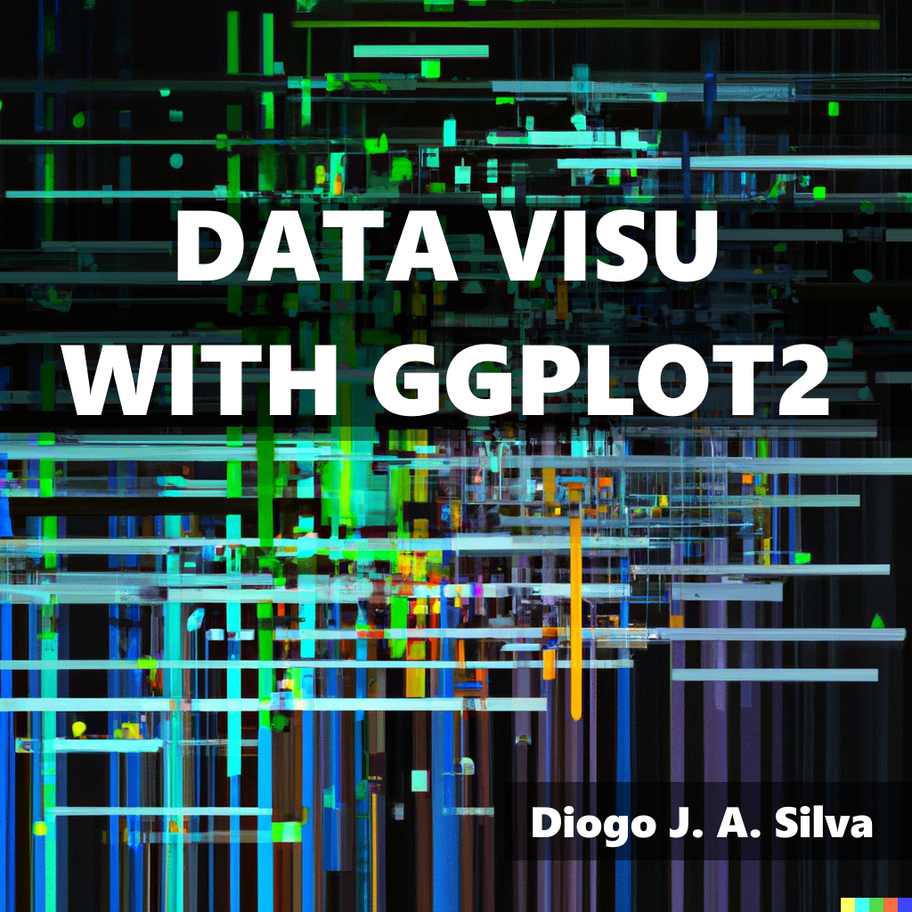

--- 
title: "R Zero - do simples ao complexo"
author: "Diogo J. A. Silva"
date: "`r Sys.Date()`"
site: bookdown::bookdown_site
documentclass: book
bibliography: [book.bib]
# url: your book url like https://bookdown.org/yihui/bookdown
# cover-image: path to the social sharing image like images/cover.jpg
description: |
  This is a minimal example of using the bookdown package to write a book.
  The HTML output format for this example is bookdown::gitbook,
  set in the _output.yml file.
link-citations: yes
github-repo: rstudio/bookdown-demo
---

# Bem-vindos

Esse livro foi criado para introduzir e orientar novos usuarios academicos do programa R e RStudio. A ideia eh fornecer os conceitos essenciais para a utilizacao do R, guiando o leitor atraves da linguagem R, introduzindo pilulas de conceitos que irao se complementando ao longo dos capitulos.
  
Ja existem livros muito bons sobre o assunto, entao por que utilizar esse em especifico? Eu acredito que o diferencial desse livro eh como ele esta organizado. Comecando com conceitos basicos, e adicionando complexidade de uma forma fluida e didatica. Claro que já existem livros muito bons sobre o assunto (https://rkabacoff.github.io/datavis/ e https://r-graphics.org/), porém são livros em inglês e pouco amigáveis para iniciantes. Claro que existe um livro muito bom em português e serve para iniciantes (https://analises-ecologicas.netlify.app/), mas não é focado em visualização de dados. Portanto, nesse livro, iniciantes terão uma boa base introdutória no R e serão direcionados para a visualização de dados de forma mais simples e organizada.

Neste livro, você encontrará o essencial para produzir gráficos em R utilizando o pacote ggplot2. Para o melhor aproveitamento do conteúdo, você precisará entender como o R funciona e também compreender de forma clara os conceitos de variáveis estatísticas (ou seja, variável nominal, quantitativa, etc.). Com isso em mente, você poderá pular para qualquer parte do livro e aproveitar seu conteúdo, que se mostrará independente caso você tenha todos os pré-requisitos (ou seja, R + RStudio instalados).

Se você já possui os conhecimentos básicos de estatística e R, sinta-se livre para pular para qualquer parte do livro e aproveitar os códigos dos gráficos. :)
  